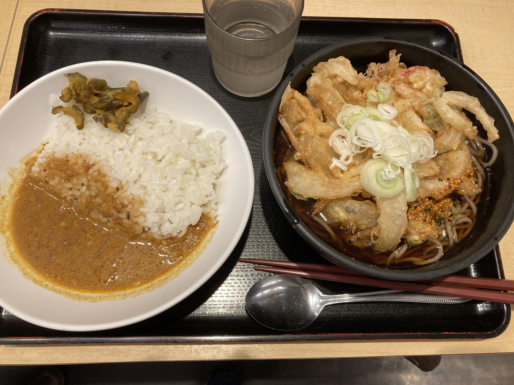
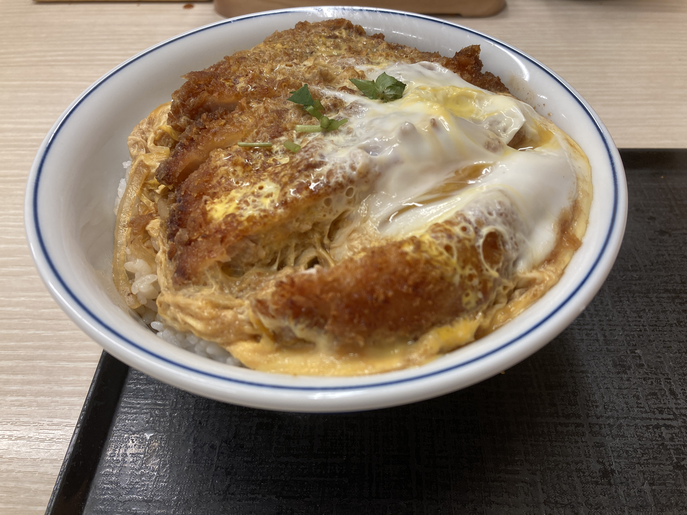
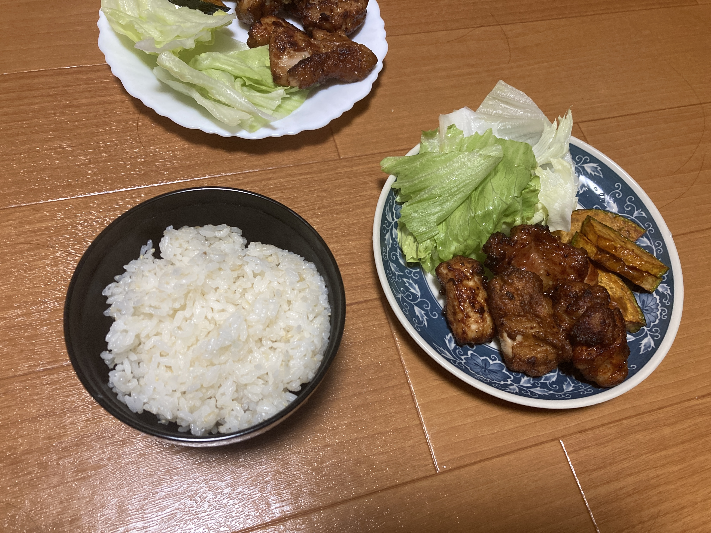
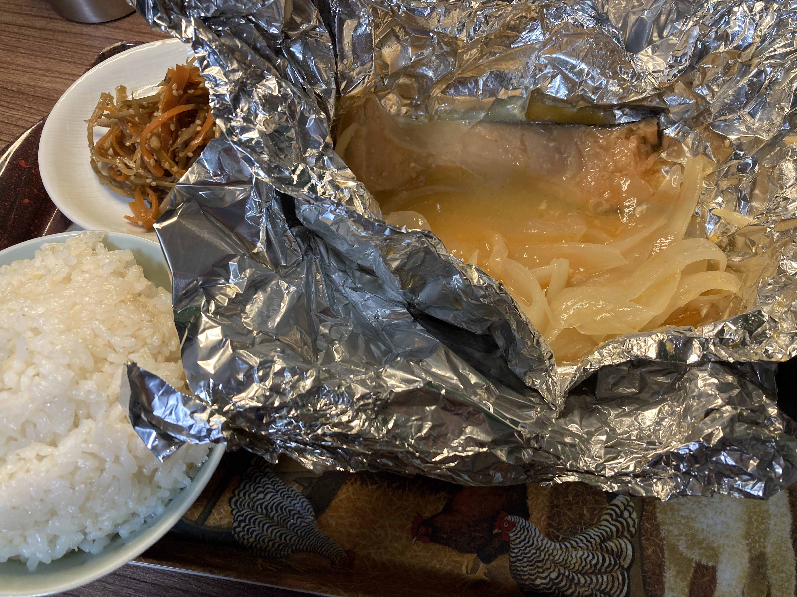
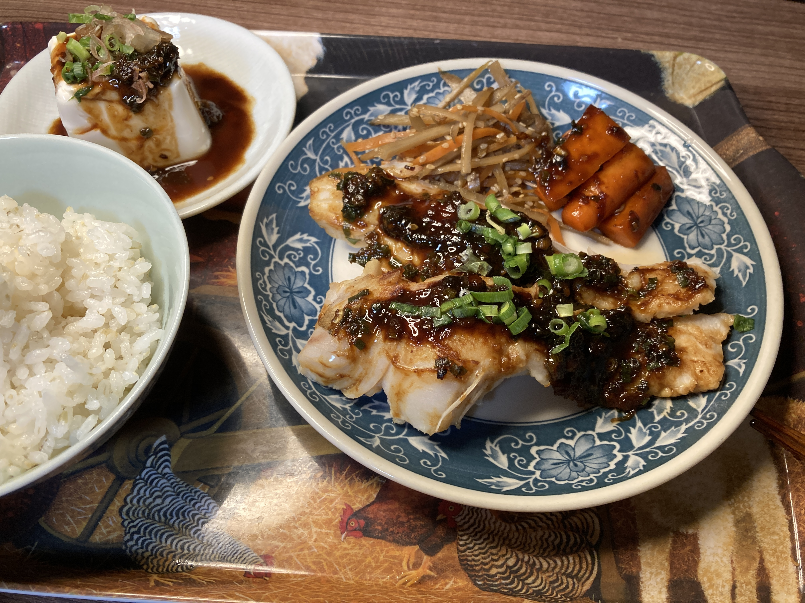
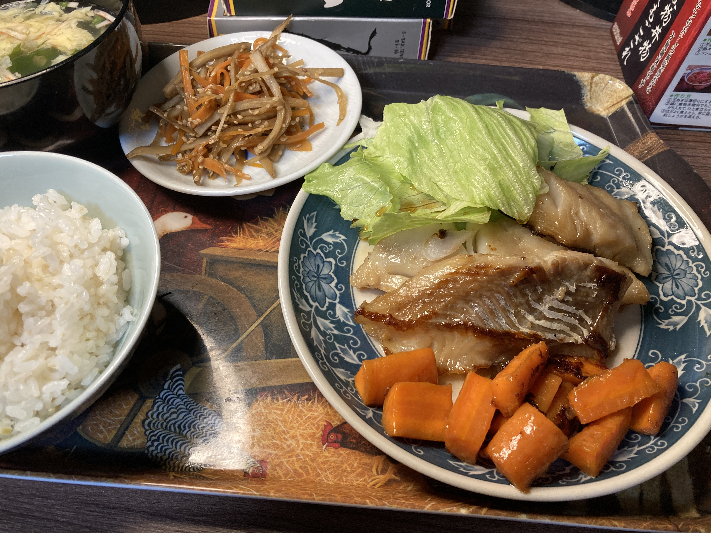
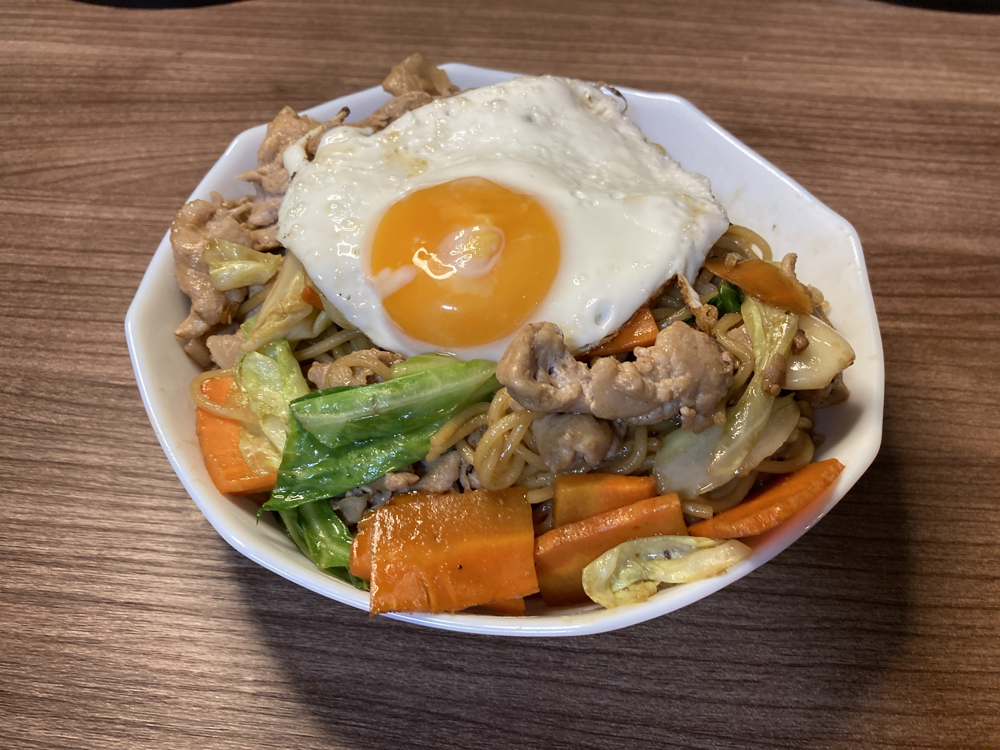
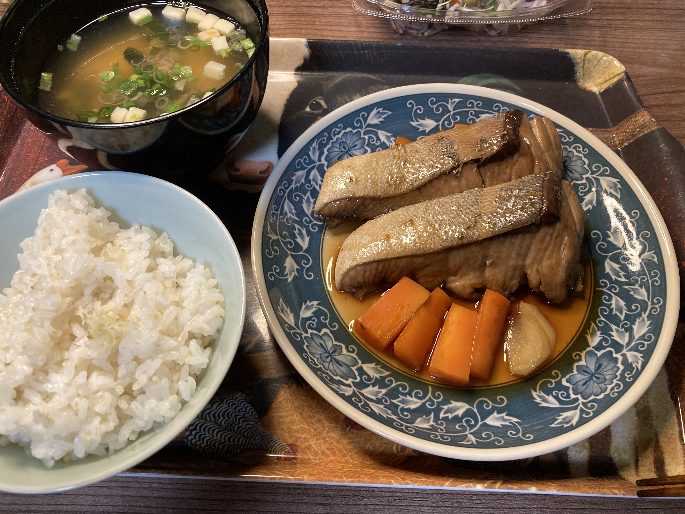
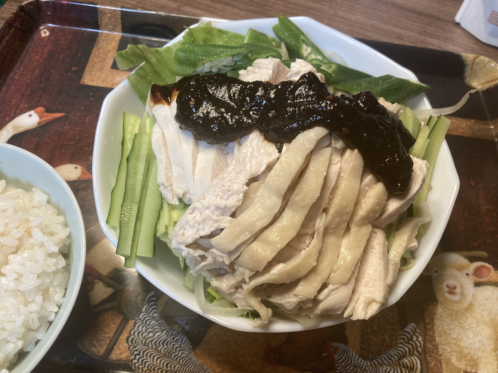

## おすすめメニュー

自分が食べて美味しかった順

1. 西京漬けのホイル焼き
2. 白身魚の炊き物
3. ジャーマンポテト

いつでも食べに来てもらっていいですよ

## 6 月

### 6 月 13 日

昨日の話。冷蔵庫に、鶏肉のカレーカツレツが見つかった。

賞味期限は 4 日前、半額シールが貼られている。

さすがに、鶏肉はまずいか。

でも、明日になるとわずかに異臭を放ちそうだったので、今日中に調理しておくことにした。

大粒のニンニクをスライスして、オリーブオイルでローストする。

ニンニクの香りが立ってきたら、カツレツを並べる。

フライパンを回して油をなじませ、中火で焦げ目をつけたら、裏返して弱火で 30 分ぐらい置いておく。

鶏肉、特にむね肉は、水分が飛ばないようにゆっくり加熱するとおいしい。

タッパにいれて、翌日、オーブンで焼きなおす。

衣とニンニクがカリカリになっておいしい。

4 日切れた鶏肉が食べてはいけない物なのかは、明日わかるでしょう。

### 6 月 12 日

イベントの翌日で疲れてるのに、天気はじめじめしたはっきりしない雨で、一日中布団でゴロゴロしていた。

腹が減ってきたので、流石に垂直になった。

キッチンを見ると、煮付けの煮汁がフライパンに入ったままになってた。

片付けろやお前と言われそうだが、生姜の欠片がバラバラ入ってる。

ちょっと舐めてみると、魚の旨味が感じられておいしくなりそうだ。

ということで、このタレを使って生姜焼きを作ってみることにした。

タレを一旦うつわに移し、フライパンに片栗粉を軽く振った豚ロースを並べる。

前回の反省を生かして、豚ロースの縁の油は外しておいた。

焼けてきたら、料理酒をまわしかける。

なんか、肉に酒をかけると固くなるような気がするんだけど、たぶん気のせい。

先ほどの煮汁に、酒、醤油、酢、砂糖、さらにチューブニンニクと追いチューブ生姜を入れてかき混ぜる。ニンニク＆ショウガなんてなんぼ（ry

タレをフライパンに入れると、食欲をそそるニンニク＆ショウガが鼻を刺激する。

肉の油と合わさって、最強のタレが生成されている。

### 6 月 11 日

日本橋。よもだそば。特大かき揚げそば半カレーセット。

立ち食いそば屋とは思えないほどツッコミどころが多い。

インドカレー。バターの甘み

けっこう量が多い。

蕎麦屋で印度カレーは初めて食べた。

蕎麦のつゆをちびちびすすりながら、カレーを食べるのが非常に良い。
バター × 醤油 = 優勝 という法則を蕎麦屋に応用する

かき揚げが大きい。
玉ねぎが、かき揚げにしては大きめに切られているが、しっかり甘い。

### 6 月 10 日

かつ丼くえよおぉぉぉ 👉👉👉👉

### 6 月 9 日

ラボの交流会に持ってったジャーマンポテト。

鯛が食べたい！（総統閣下）

食べた（ぶるんぶるん）

### 6 月 8 日

いつもの。

### 6 月 7 日

唐揚げァァァァァァ！！！！

### 6 月 6 日

西京漬けのホイル焼き。

バター × 味噌 = 優勝

トロトロの玉ねぎがめっちゅうまい。

反省：火にかけたまま風呂入ってた（重大インシデント）

### 6 月 5 日

たらの田楽焼き。

たらを日本酒で軽く炊いた後に、味噌を塗ってオーブンで焼いた。

結論、失敗。酒で味が先に入ってしまい、味噌味が表面だけになっちゃった。

### 6 月 4 日

たらのバター焼き。

うまい。

付け合わせのにんじんもうまい。

### 6 月 3 日

### 6 月 2 日

### 6 月 1 日

## 5 月

### 5 月 31 日

### 5 月 30 日

