% 2048 on リレーコンピュータ
%
%

|                       |                       |                       |                       |
| --------------------- | --------------------- | --------------------- | --------------------- |
|  |  |  |  |
|  |  |  |  |
|  |  |  |  |
|  |  |  |  |

<button onclick="init()">Init</button>
<button onclick="show()">↑</button>
<button onclick="show()">↓</button>
<button onclick="show()">→</button>
<button onclick="show()">←</button>

