% CPU入門
%
%

## ステートマシン

``` typescript
type State = any;
type Transition = (s: State) => State;

let state: State;
let transition: Transition;

while (true) {
  state = transition(state);
}
```



### 入力を受け付けるステートマシン


``` typescript
type State = any;
type Transition = (s: State) => State;
type Input = () => (s: State) => State;

let state: State;
let transition: Transition;
let input : Input;

while (true) {
  state = transition(state);
  state = input()(state);
}
```

### スイッチをONするとOFFするロボット


``` typescript
type State = "on" | "off";
type Transition = (s: State) => State;
type Input = () => (s: State) => State;

let state: State = "off";
let transition: Transition = (s: State) => "off";
let input : Input;

while (true) {
  state = transition(state);
  state = input()(state);
}
```

## プログラマブルステートマシン

プログラムカウンタを明示的に分離する

``` typescript
type State = any;
type Transition = (s: State) => State;

let state: State;
let program: Transition[];
let counter: number = 0;

while (true) {
  state = program[counter](state);
  counter++;
}
```

### プログラムの分岐がある場合

``` typescript
type State = any;
type Transition = (s: State) => [State, number];

let state: State;
let program: Transition[];
let counter: number = 0;

while (true) {
  [state, counter] = program[counter](state);
}
```

