% ロジック
%
%

## ステートマシン

``` typescript
type State = any;
type Transition = (s: State) => State;

let s: State;
let f: Transition;

while (true) {
  s = f(s);
}
```


### 入力を受け付けるステートマシン

### スイッチをONするとOFFするロボット




``` typescript
type State = "on" | "off";
type Transition = (s: State) => State;

let s: State = "off";
let f: Transition = (s: State) => "off";
let readInput: () => State;

while (true) {
  s = f(s);
  s = readInput();
}
```

## プログラマブルステートマシン

``` typescript
type State = any;
type Transition = (s: State) => State;

let s: State;
let F: Transition[];
let i: number = 0;

while (true) {
  s = F[i](s);
  i++;
}
```


### 条件分岐

``` typescript
type State = any;
type Transition = (s: State) => [State, number];

let s: State;
let F: Transition[];
let i: number = 0;

while (true) {
  [s,i] = F[i](s);
}
```


