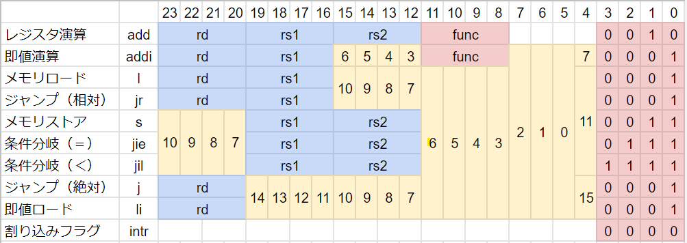

RISC-V をベースに、16bit 向けに小細工をしました。

## レジスタ

|        |      | 機能                             | 保持 |
| ------ | ---- | -------------------------------- | ---- |
| x0     | zero | ゼロ固定                         | -    |
| x1     | ra   | 戻りアドレス                     | ✕    |
| x2     | sp   | スタック・ポインタ               | 〇   |
| x3     | gp   | グローバル・ポインタ             | 〇   |
| x4-7   | s0-3 | 保存レジスタ                     | 〇   |
| x8-11  | t0-3 | 一時レジスタ                     | ✕    |
| x12-15 | a0-3 | 引数・返値                       | ✕    |
| -      | pc   | プログラムカウンタ               | -    |
| -      | csr  | コントロール＆ステータスレジスタ | -    |

## 命令セット

`r[x0]` はレジスタ x0 の値を、`m[xx]` はメモリの xx 番地の値を意味します。

`i(x)` は x bit の即値を、`is` は符号拡張する即値を意味します。

#### 符号拡張とは

4bit の符号付き整数を 8bit にしたい場合、正の数は 0 を埋めればいいですが、負の数は 1 を埋める必要になります。符号付き整数の符号は、最上位 bit で表されるので、一般に、符号付き整数の bit 長を伸ばしたい場合、最上位ビットで埋める必要があります。これが符号拡張です。

|     |      |          |
| --- | ---- | -------- |
| 1   | 0000 | 0001     |
| 1   |      | **0**001 |
| 0   |      | 0000     |
| -1  |      | **1**111 |
| -1  | 1111 | 1111     |

RISC-K では RISC-V に倣って、命令の即値の最上位 bit の位置を揃えることで、符号拡張のハードウェアを単純にします。

### レジスタ演算

> add rd, rs1, rs2
>
> r[rd] = r[rs1] + r[rs2]

|     | 演算                   |
| --- | ---------------------- |
| +   | add                    |
| -   | sub                    |
| ^   | xor                    |
| \|  | or                     |
| &   | and                    |
| <   | less than              |
| <   | less than unsigned     |
| >>  | shift left logical     |
| >>  | shift left arithmetic  |
| <<  | shift right logical    |
| <<  | shift right arithmetic |

### 即値演算

> addi rd, rs1, is(8)
>
> r[rd] = r[rs1] + is(8)

16bit で演算したい場合は、即値ロードをした後に演算をする。

### 即値ロード

> li rd, i(16) (Load Immidiate)
>
> r[rd] = i(16)

### メモリアクセス

> l rd, rs1, is(12)
>
> r[rd] = m[r[rs1]+is(12)]

> s rs1, rs2, is(12)
>
> m[r[rs1]+is(12)] = r[rs2]

rs1 を zero レジスタとすることで、絶対参照ができる。

12bit より広い範囲を参照したい場合は即値ロードを使う。

### 条件分岐

> jie rs1, rs2, is(12) (Jump If rs1 Equal rs2)
>
> jil rs1, rs2, is(12) (Jump If rs1 is Less than rs2)
>
> PC += is(12)

ALU で減算 r[rs1] - r[rs2] を行い、その結果で分岐判定をします。

分岐先アドレスは、現在の PC に即値を足したアドレスです。

即値は符号拡張するので、マイナスのアドレスにも分岐できます。

分岐条件は、

1. 一致（r[rs1] == r[rs2]）

   演算結果の全 bit の nor を取る（全部 0 のときだけ 1）

2. 未満（r[rs1] < r[rs2]）

   演算結果の符号 bit（負の場合は 1）

### ジャンプ

> j rd, i(16) (Call)
>
> r[rd] = PC + 1
>
> PC = i(16)

> jr rd, rs1, is(12)
>
> r[rd] = PC + 1
>
> PC = r[rs1] + is(12)

戻りアドレスを rd に保存し、PC を即値にする。

#### 分岐とジャンプの違いについて

分岐は関数内での if 文に、ジャンプは関数呼び出しに対応する。

if の分岐先は近いアドレスであるが、関数呼び出しは遠いアドレスであることも多い。

また、関数呼び出しは戻りアドレスを記憶しておく必要がある。

条件分岐はコンパイラで相対位置を決める。

関数呼び出しはリンカが絶対位置を決める。

### 割り込み

> intr xxxxx

割り込みフラグを設定する。

### サブルーチン

[参考](https://inst.eecs.berkeley.edu/~cs61c/resources/RISCV_Calling_Convention.pdf)

| ASM            |                                          |
| -------------- | ---------------------------------------- |
| subi sp sp 5   | スタックポインタを減算し、スタックを確保 |
| store s0 0(sp) | レジスタをスタックに退避                 |
| store s1 1(sp) |                                          |
| store s1 2(sp) |                                          |
| store s1 3(sp) |                                          |
| store ra 4(sp) | リターンアドレスも退避                   |
| loadi a0 334   | 引数をレジスタにセット                   |
|                | レジスタが足りなければスタックにセット   |
| jal            | サブルーチンにジャンプ                   |
| :              |                                          |
| :              | サブルーチンの処理                       |
| :              |                                          |
| load ra 0(sp)  | レジスタを復元                           |
| load ra 1(sp)  |                                          |
| load ra 2(sp)  |                                          |
| load ra 3(sp)  |                                          |
| load ra 4(sp)  | リターンアドレスを復元                   |
| addi sp sp 5   | スタックポインタを加算                   |
| jr ra          | PC を戻す                                |

### 割り込み処理

| ASM              |                                |
| ---------------- | ------------------------------ |
| subi sp 16       | 全てのレジスタをスタックに退避 |
| store x1 0(sp)   |                                |
| :                |                                |
| store x15 14(sp) |                                |
| jal              | ジャンプ                       |
| :                |                                |
| :                | 割り込み処理を行う             |
| :                |                                |
| load x1 0{sp}    | レジスタを復元                 |
| :                |                                |
| load x15 14(sp)  |                                |
| jr ra            | PC を戻す                      |

### 割り込み

### 実行時エラー

割り込みとしてエラー処理を行う。

エラーコードを状態レジスタにセットし割り込み。

- スタックオーバーフロー
- メモリの範囲外アクセス

## メモリ空間

| Addr        | Function |
| ----------- | -------- |
| 0000 ~ 000F | レジスタ |
|             |          |
|             | IO       |
|             | VRAM     |
|             | EEPROM   |
|             | RAM      |

### レジスタ

- 実体としては、SRAM の一部分
- 4bit でアクセスする → ISA でビットを節約できる

### IO

IO は SRAM とは別に Dual Port SRAM または DFF の IC を使って実装する。

このアドレスへのメモリアドレスは、別のデバイスにスイッチする。

各 IO に必要なパラメタ数がわからないので、仮です。

#### GPIO

#### ADC

#### DAC

#### PWM

#### UART

#### SPI

#### I2C

### VRAM (Dual access SRAM)

表示の候補として、

- 300 x 400 画素 : RGB 4 段階 (6bit)
- 300 x 400 画素 : 白黒 2 段階 (1bit)
- テキスト表示（フォントを EEPROM に置いておく）

### ROM (EEPROM)

### RAM (SRAM)

## 回路

### ID

命令デコーダ。機械語命令をもとに、マルチプレクサを切り替えて、データの経路を決める。

#### 動作：

4 クロックで 1 命令を実行する。

それぞれのステージで何をするか

0. PC のカウントアップ
1. S1 のロード
2. S2 のロード
3. メモリにストア

|      | ALU Func      | ALU OUT |       | 2.ADR | 3.ADR  | RS1_SEL | RS2_SEL | S2_SEL | RAM_CON | ALU_CON | PC_CON |
| ---- | ------------- | ------- | ----- | ----- | ------ | ------- | ------- | ------ | ------- | ------- | ------ |
| add  | Func(RS1,RS2) | REG     | 0:ALU | rd    | rs1    | rs2     | 1       | -      | Func    | -       |
| addi | Func(RS1,IMM) | REG     | 0:ALU | rd    | rs2    | -       | 0       | -      | Func    | -       |
| li   | ADD(ZERO,IMM) | REG     | 0:ALU | rd    | 0:zero | -       | 0       | -      | ADD     | -       |
| l    | ADD(RS1,IMM)  | ADR     | 1:MEM | rd    | rs1    | -       | 0       | READ   | ADD     | -       |
| s    | ADD(RS1,IMM)  | ADR     | -     | rs1   | rs2    | 0       | WRITE   | ADD    | -       |
| be   | SUB(RS1,RS2)  | PFC     | -     | rs1   | rs2    | 0       | -       | SUB    |         |
| bl   | SUB(RS1,RS2)  | PFC     | -     | rs1   | rs2    | 0       | -       | SUB    |         |
| j    | ADD(ZERO,IMM) | PFC     | rd    | -     | -      | -       | -       | -      |         |
| jr   | ADD(RS1,IMM)  | PFC     | rd    | rs1   | -      | 0       | -       | ADD    |         |

#### タイミングチャート：

0. PC のカウントアップ
1. S1 のロード

   アドレスに RS1 をセットします。

2. S2 のロード

ALU の 2 つの入力を S1,S2 レジスタにセットします。

3. 実行

#### 即値デコード：

### PFC

プログラムフローコントローラ。

ジャンプ命令、分岐命令、割り込みによる、プログラムの流れの変化を処理する。

#### 動作：

|     | 次の PC               |
| --- | --------------------- |
| -   | PC+1                  |
| jie | ALU=0 ? PC+IMM : PC+1 |
| jil | ALU>0 ? PC+IMM : PC+1 |
| j   | IMM                   |
| jr  | ALU                   |
