RISC-V をベースに、16bit 向けに小細工をしました。

## レジスタ

|        |      | Func                 | 保持 |
| ------ | ---- | -------------------- | ---- |
| x0     | zero | ゼロ固定             | -    |
| x1     | ra   | 戻りアドレス         | ✕    |
| x2     | sp   | スタック・ポインタ   | 〇   |
| x3     | gp   | グローバル・ポインタ | 〇   |
| x4-7   | s0-3 | 保存レジスタ         | 〇   |
| x8-11  | t0-3 | 一時レジスタ         | ✕    |
| x12-15 | a0-3 | 引数・返値           | ✕    |

## 命令セット

|       | rd  | rs1 | rs2 | imm |
| ----- | --- | --- | --- | --- |
| add   |     |     |     | -   |
| addi  |     |     | -   |     |
| load  |     |     | -   |     |
| store | -   |     |     |     |
| beq   | -   |     |     |     |

### 命令フォーマット

|     | 15-12 | 11-8 | 7-4 | 3-0 |
| --- | ----- | ---- | --- | --- |
|     | OPC   | rd   | rs1 | rs2 |

16bit に即値フィールドが取れない問題

RISC-V では特殊な機能をもったレジスタはなく、命令の引数に自由なレジスタをとることができる。
対して x86 では特定の機能ってレジスタが強固に結びついている。
自由度が上がるものの実際はコンパイラは機能とレジスタの対応をとる。
実装上、そうしたほうが良いプロセッサ現在多い。

なので、命令

### レジスタ演算

> add rd, rs1, rs2
>
> x[rd] = x[rs1] + x[rs2]

### 即値演算

> addi rd, rs, imm
>
> x[rd] = x[rs] + imm

### メモリアクセス

> load rd, rs, imm
>
> x[rd] = m[ x[rs] + imm ]

メモリの「レジスタ rs + 即値 imm 」番地の値を、レジスタ rd に書き込む。

rs を zero レジスタとすることで、絶対参照ができる。

> store rs1, rs2, imm
>
> m[ x[rs] + imm] = x[rs]

レジスタ rd の値を、メモリの「レジスタ rs + 即値 imm 」番地に書き込む。

### 条件分岐

> beq rs1, rs2, imm

if(x[rs1]==x[rs2]) PC = PC + 4 + imm
(else PC = PC + 4)

### ジャンプ

> jal rd, offset

1. 戻りアドレス（PC + 4）を rd に保存

   x[rd] = PC + 4

2. 「PC + offset」にジャンプ

   PC += offset

> jalr rd, rs1, offset

1. 戻りアドレス（PC + 4）を rd に保存

   x[rd] = PC + 4

2. 「レジスタ rs1 + offset」にジャンプ

   PC = x[rs1] + offset

### 割り込み

> intr xxxxx

割り込みフラグを設定する。

### サブルーチン

https://inst.eecs.berkeley.edu/~cs61c/resources/RISCV_Calling_Convention.pdf

1. 退避するレジスタ数だけ、スタックポインタを減算
2. レジスタをスタックに退避
3. リターンアドレスをスタックに退避
4. 引数をレジスタにセット
5. レジスタが足りなければスタックにセット
6. サブルーチンにジャンプ
7. レジスタを復元
8. リターンアドレスを復元
9. スタックポインタを加算
10. リターンアドレスにジャンプ

### 割り込み処理

1. 全てのレジスタをスタックに退避
2. 割り込み番号に応じて、ジャンプ
3. 割り込み処理を行う
4. レジスタを復元
5. PC を戻す

### 割り込み

## メモリ空間

| Addr | Function |
| ---- | -------- |
|      | IO       |
|      | VRAM     |
|      | EEPROM   |
|      | RAM      |

### IO

各 IO に必要なパラメタ数がわからないので、仮です。

#### GPIO

#### ADC

#### DAC

#### PWM

#### UART

#### SPI

#### I2C

### VRAM (Dual access SRAM)

表示の候補として、

- 300 x 400 画素 : RGB 4 段階 (6bit)
- 300 x 400 画素 : 白黒 2 段階 (1bit)
- テキスト表示（フォントを EEPROM に置いておく）

### ROM (EEPROM)

### RAM (SRAM)

## 回路

