RISC-V をベースに、16bit 向けに小細工をしました。

## レジスタ

|        |      | 機能                             | 保持 |
| ------ | ---- | -------------------------------- | ---- |
| x0     | zero | ゼロ固定                         | -    |
| x1     | ra   | 戻りアドレス                     | ✕    |
| x2     | sp   | スタック・ポインタ               | 〇   |
| x3     | gp   | グローバル・ポインタ             | 〇   |
| x4-7   | s0-3 | 保存レジスタ                     | 〇   |
| x8-11  | t0-3 | 一時レジスタ                     | ✕    |
| x12-15 | a0-3 | 引数・返値                       | ✕    |
| -      | pc   | プログラムカウンタ               | -    |
| -      | csr  | コントロール＆ステータスレジスタ | -    |

## 命令セット

| 命令           | アセンブリ            |                                     |
| -------------- | --------------------- | ----------------------------------- | ---------------------------------------- |
| レジスタ演算   | add rd, rs1, rs2      | r[rd] = r[rs1] + r[rs2]             | レジスタ間で演算                         |
| 即値演算       | addi rd, rs1, is(12)  | r[rd] = r[rs1] + i(16)              | 12bit の即値と演算                       |
| ロード         | load rd, rs1, i(16)   | r[rd] = m[r[rs1]+i(16)]             | rs1 = zero で絶対参照                    |
| ストア         | store rs1, rs2, i(16) | m[r[rs1]+is(12)] = r[rs2]           |                                          |
| 即値ロード     | loadi rd, i(16)       | r[rd] = i(16)                       |                                          |
| 条件分岐（＝） | be rs1, rs2, i(16)    | if(r[rs1]=r[rs2]) PC = is(16)       |
| 条件分岐（＜） | bl rs1, rs2, i(16)    | if(r[rs1]<r[rs2]) PC = is(16)       |                                          |
| ジャンプ       | jump rd, rs1, i(16)   | r[rd] = PC + 1, PC = r[rs1] + i(16) | 戻りアドレスを rd に保存 & PC をジャンプ |

`r[x0]` はレジスタ x0 の値を、`m[xx]` はメモリの xx 番地の値を意味します。

`i(x)` は x bit の即値を、`is` は符号拡張する即値を意味します。

#### 符号拡張とは

4bit の符号付き整数を 8bit にしたい場合、正の数は 0 を埋めればいいですが、負の数は 1 を埋める必要になります。符号付き整数の符号は、最上位 bit で表されるので、一般に、符号付き整数の bit 長を伸ばしたい場合、最上位ビットで埋める必要があります。これが符号拡張です。

|     |      |          |
| --- | ---- | -------- |
| 1   | 0000 | 0001     |
| 1   | ↑↑↑← | **0**001 |
| 0   |      | 0000     |
| -1  | ↓↓↓← | **1**111 |
| -1  | 1111 | 1111     |

RISC-K では RISC-V に倣って、命令の即値の最上位 bit の位置を揃えることで、符号拡張のハードウェアを単純にします。

### 演算

|     | 演算 |     |                        |
| --- | ---- | --- | ---------------------- |
| +   | add  | <   | less than              |
| -   | sub  | <   | less than unsigned     |
| &   | and  | >>  | shift left logical     |
| \|  | or   | >>  | shift left arithmetic  |
| ^   | xor  | <<  | shift right logical    |
| ~   | not  | <<  | shift right arithmetic |

### メモリアクセス

rs1 を zero レジスタとすることで、絶対参照ができる。

12bit より広い範囲を参照したい場合は即値ロードを使う。

### 条件分岐

ALU で減算 r[rs1] - r[rs2] を行い、その結果で分岐判定をします。

分岐先アドレスは、現在の PC に即値を足したアドレスです。

即値は符号拡張するので、マイナスのアドレスにも分岐できます。

分岐条件は、

1. 一致（r[rs1] == r[rs2]）

   演算結果の全 bit の nor を取る（全部 0 のときだけ 1）

2. 未満（r[rs1] < r[rs2]）

   演算結果の符号 bit（負の場合は 1）

### 分岐とジャンプの違い

分岐は関数内での if 文に、ジャンプは goto または関数呼び出しに対応する。if の分岐先は近いアドレスであるが、関数呼び出しは遠いアドレスであることも多い。また、関数呼び出しは戻りアドレスを記憶しておく必要がある。条件分岐はコンパイラで相対位置を決める。goto や関数呼び出しはリンカがラベルに対してアドレスを付与する。

### 割り込み

> intr xxxxx

割り込みフラグを設定する。

### 割り込み

### 実行時エラー

割り込みとしてエラー処理を行う。

エラーコードを状態レジスタにセットし割り込み。

- スタックオーバーフロー
- メモリの範囲外アクセス

## メモリ空間

| Addr        | Function |
| ----------- | -------- |
| 0000 ~ 000F | レジスタ |
|             |          |
|             | IO       |
|             | VRAM     |
|             | EEPROM   |
|             | RAM      |

### レジスタ

- 実体としては、SRAM の一部分
- 4bit でアクセスする → ISA でビットを節約できる

### IO

IO は SRAM とは別に Dual Port SRAM または DFF の IC を使って実装する。このアドレスへのメモリアドレスは、別のデバイスにスイッチする。各 IO に必要なパラメタ数がわからないので、仮です。

#### GPIO

#### ADC

#### DAC

#### PWM

#### UART

#### SPI

#### I2C

### VRAM (Dual access SRAM)

表示の候補として、

- 300 x 400 画素 : RGB 4 段階 (6bit)
- 300 x 400 画素 : 白黒 2 段階 (1bit)
- テキスト表示（フォントを EEPROM に置いておく）

### ROM (EEPROM)

### RAM (SRAM)

## 回路

### ID

命令デコーダ。機械語命令をもとに、マルチプレクサを切り替えて、データの経路を決める。

#### 動作：

4 クロックで 1 命令を実行する。

0. PC のカウントアップ
1. メモリを読み出し、RS1 に記録
2. メモリを読み出し、RS2 に記録
3. メモリに書き込み

|       | ALU  | S2  | DIN | 1.R ADR | 2.R ADR | 3.W ADR |
| ----- | ---- | --- | --- | ------- | ------- | ------- |
| add   | Func | RS2 | ALU | RS1     | RS2     | RD      |
| addi  | Func | IMM | ALU | RS1     | -       | RD      |
| load  | ADD  | IMM | RS2 | RS1     | ALU     | RD      |
| store | ADD  | IMM | RS2 | RS1     | RS2     | ALU     |
| loadi | -    | -   | IMM | -       | -       | RD      |
| be    | SUB  | RS2 | -   | RS1     | RS2     | 0       |
| bl    | SUB  | RS2 | -   | RS1     | RS2     | 0       |
| jump  | ADD  | IMM | PC  | RS1     | -       | RD      |

\- は何でも大丈夫（なはず）

#### タイミングチャート：

0. PC のカウントアップ
1. S1 のロード

   アドレスに RS1 をセットします。

2. S2 のロード

ALU の 2 つの入力を S1,S2 レジスタにセットします。

3. 実行

#### デコーダ回路

### PFC

プログラムフローコントローラ。

ジャンプ命令、分岐命令、割り込みによる、プログラムの流れの変化を処理する。

#### 動作：

|      | 次の PC            |
| ---- | ------------------ |
| -    | PC+1               |
| be   | ALU=0 ? IMM : PC+1 |
| bl   | ALU>0 ? IMM : PC+1 |
| jump | ALU                |
