RISC-V をベースに、16bit 向けに小細工をしました。

## レジスタ

0x00 ~ 0x3F まで 64 本のレジスタ。

|             |      | 機能                             | 保持 |
| ----------- | ---- | -------------------------------- | ---- |
| 0x00        | zero | ゼロ固定                         | -    |
| 0x01        | ra   | 戻りアドレス                     | ✕    |
| 0x02        | sp   | スタック・ポインタ               | 〇   |
| 0x03        | gp   | グローバル・ポインタ             | 〇   |
| 0x10 - 0x1F | s0-3 | 保存レジスタ                     | 〇   |
| 0x20 - 0x2F | t0-3 | 一時レジスタ                     | ✕    |
| 0x30 - 0x3F | a0-3 | 引数・返値                       | ✕    |
| -           | pc   | プログラムカウンタ               | -    |
| -           | csr  | コントロール＆ステータスレジスタ | -    |

## 命令セット

| 命令           | アセンブリ            |                                     |
| -------------- | --------------------- | ----------------------------------- | ---------------------------------------- |
| レジスタ演算   | add rd, rs1, rs2      | r[rd] = r[rs1] + r[rs2]             | レジスタ間で演算                         |
| 即値演算       | addi rd, rs1, is(12)  | r[rd] = r[rs1] + is(12)             | 12bit の即値と演算                       |
| ロード         | load rd, rs1, i(16)   | r[rd] = m[r[rs1] + i(16)]           | rs1 = zero で絶対参照                    |
| ストア         | store rs1, rs2, i(16) | m[r[rs1]+is(12)] = r[rs2]           |                                          |
| 即値ロード     | loadi rd, i(16)       | r[rd] = i(16)                       |                                          |
| ジャンプ       | jump rd, rs1, i(16)   | r[rd] = PC + 1, PC = r[rs1] + i(16) | 戻りアドレスを rd に保存 & PC をジャンプ |
| 条件分岐（＝） | be rs1, rs2, i(16)    | if(r[rs1]=r[rs2]) PC = i(16)        |                                          |
| 条件分岐（＜） | bl rs1, rs2, i(16)    | if(r[rs1]<r[rs2]) PC = i(16)        |                                          |

`r[x]` はレジスタ x の値を、`m[x]` はメモリの x 番地の値を意味します。

`i(x)` は x bit の即値を、`is` は符号拡張する即値を意味します。

#### 符号拡張とは

4bit の符号付き整数を 8bit にしたい場合、正の数は 0 を埋めればいいですが、負の数は 1 を埋める必要になります。符号付き整数の符号は、最上位 bit で表されるので、一般に、符号付き整数の bit 長を伸ばしたい場合、最上位ビットで埋める必要があります。これが符号拡張です。

|     |      |          |
| --- | ---- | -------- |
| 1   | 0000 | 0001     |
| 1   | ↑↑↑← | **0**001 |
| 0   |      | 0000     |
| -1  | ↓↓↓← | **1**111 |
| -1  | 1111 | 1111     |

### 演算の種類

| func | 演算  | func | 演算                      |
| ---- | ----- | ---- | ------------------------- |
| 0    | + add | 6    | < less than               |
| 1    | - sub | 7    | < less than unsigned      |
| 2    | & and | 8    | >> shift left logical     |
| 3    | \| or | 9    | >> shift left arithmetic  |
| 4    | ^ xor | A    | << shift right logical    |
| 5    | ~ not | B    | << shift right arithmetic |

### 割り込み

割り込みとしてエラー処理を行う。

エラーコードを状態レジスタにセットし割り込み。

- スタックオーバーフロー
- メモリの範囲外アクセス

## メモリ空間

| Addr        | Function |
| ----------- | -------- |
| 0000 ~ 000F | レジスタ |
|             |          |
|             | IO       |
|             | VRAM     |
|             | EEPROM   |
|             | RAM      |

### レジスタ

- 実体としては、SRAM の一部分
- 4bit でアクセスする → ISA でビットを節約できる

### IO

IO は SRAM とは別に Dual Port SRAM または DFF の IC を使って実装する。このアドレスへのメモリアドレスは、別のデバイスにスイッチする。各 IO に必要なパラメタ数がわからないので、仮です。

### VRAM (Dual access SRAM)

表示の候補として、

- 300 x 400 画素 : RGB 4 段階 (6bit)
- 300 x 400 画素 : 白黒 2 段階 (1bit)
- テキスト表示（フォントを EEPROM に置いておく）

### Program ROM (NOR Flash)

### RAM (SRAM)

## 回路

### ID

命令デコーダ。機械語命令をもとに、マルチプレクサを切り替えて、データの経路を決める。

#### 動作：

4 クロックで 1 命令を実行する。

0. メモリを読み出し、RS1 に記録
1. メモリを読み出し、RS2 に記録
2. メモリに書き込み
3. PC のカウントアップ

|       | ALU  | S2  | DIN | 1.R ADR | 2.R ADR | 3.W ADR |
| ----- | ---- | --- | --- | ------- | ------- | ------- |
| add   | Func | RS2 | ALU | RS1     | RS2     | RD      |
| addi  | Func | IMM | ALU | RS1     | -       | RD      |
| load  | ADD  | IMM | RS2 | RS1     | ALU     | RD      |
| store | ADD  | IMM | RS2 | RS1     | RS2     | ALU     |
| loadi | -    | -   | IMM | -       | -       | RD      |
| jump  | ADD  | IMM | PC  | RS1     | -       | RD      |
| be    | SUB  | RS2 | -   | RS1     | RS2     | 0       |
| bl    | SUB  | RS2 | -   | RS1     | RS2     | 0       |

\- は何でも大丈夫（なはず）

#### タイミングチャート：

0. PC のカウントアップ
1. S1 のロード

   アドレスに RS1 をセットします。

2. S2 のロード

ALU の 2 つの入力を S1,S2 レジスタにセットします。

3. 実行

#### デコーダ回路

### PFC

プログラムフローコントローラ。ジャンプ命令、分岐命令、割り込みによる、プログラムの流れの変化を処理します。

#### 動作：

|      | 次の PC            |
| ---- | ------------------ |
| -    | PC+1               |
| be   | ALU=0 ? IMM : PC+1 |
| bl   | ALU>0 ? IMM : PC+1 |
| jump | ALU                |

#### 条件分岐の実装

ALU で減算 r[rs1] - r[rs2] を行い、その結果で分岐判定をします。

1. 一致（r[rs1] == r[rs2]）

   演算結果の全 bit の nor を取る（全部 0 のときだけ 1）

2. 未満（r[rs1] < r[rs2]）

   演算結果の符号 bit（負の場合は 1）
