## VFC/PFC アーキテクチャ

記憶されている値の移動と演算処理を行う Value Flow Controller (VFC) と、

プログラムの制御を行う部分 Program Flow Controller (PFC) からなるアーキテクチャ。

## 命令セット

リレーコンピュータの、4 命令 ISA をベースにする。

関数呼び出しができないので、スタックを実装する。

## 回路詳細

### メモリマップ

| Addr | Function       |
| ---- | -------------- |
| 0000 | 汎用レジスタ   |
| 0010 | 演算レジスタ   |
| 0020 | 入出力レジスタ |
| 0040 | RAM            |
|      | VRAM           |
|      | EEPROM         |

### 汎用レジスタ

| Addr |     |               | Func             |
| ---- | --- | ------------- | ---------------- |
| 0000 | x0  | zero          | ゼロ固定         |
| 0001 | x1  | retern_addr   | 戻りアドレス     |
| 0002 | x2  | stack_pointer | スタックポインタ |
| 0003 | x3  |               |                  |
| 0004 | x4  |               |                  |
| 0005 | x5  |               |                  |
| 0006 | x6  |               |                  |
| 0007 | x7  |               |                  |
| 0008 |     |               |                  |
| 0009 |     |               |                  |
| 000A |     |               |                  |
| 000B |     |               |                  |
| 000C |     |               |                  |
| 000D |     |               |                  |
| 000E |     |               |                  |
| 000F |     |               |                  |

### 演算レジスタ

このアーキテクチャでは、演算命令を MOV のエイリアスとして実装します。

あるレジスタにアクセスすることで演算結果を得るようなハードウェアになっているからです。

| Addr |          | Func                       |
| ---- | -------- | -------------------------- |
| 0010 | alu_conf | ALU の入出力レジスタを指定 |
| 0010 | sl       | < 左シフト                 |
| 0011 | sr       | > 右シフト                 |
| 0012 | add      | +                          |
| 0013 | sub      | -                          |
| 0014 | xor      | ^                          |
| 0015 | or       | \|                         |
| 0016 | and      | &                          |
| 0017 | not      | ~                          |
| 0018 |          |                            |
| 0019 |          |                            |
| 001A |          |                            |
| 001B |          |                            |
| 001C |          |                            |
| 001D |          |                            |
| 001E |          |                            |
| 001F |          |                            |

### 入出力レジスタ

| Addr | Func |
| ---- | ---- |
| 0020 | GPIO |
| 0028 | ADC  |
| 002C | DAC  |
| 0030 | PWM  |
| 0038 | I2C  |
| 00   | SPI  |
|      | UART |

#### GPIO

入出力フラグ（0 が入力、1 が出力）。

出力はトライステート、入力はシュミットトリガ。

| Addr | Name       | Func          |
| ---- | ---------- | ------------- |
| 0020 | gpio0_conf | 入出力フラグ  |
| 0021 | gpio0      | GPIO レジスタ |
| 0022 | gpio1_conf |               |
| 0023 | gpio1      |               |

#### ADC

| Addr |     |
| ---- | --- |
|      |     |

[ADC 選定中…](https://www.mouser.jp/c/semiconductors/data-converter-ics/analog-to-digital-converters-adc/?interface%20type=Parallel~~Parallel%20CMOS%2C%20Parallel%20LVDS&mounting%20style=Through%20Hole&rp=semiconductors%2Fdata-converter-ics%2Fanalog-to-digital-converters-adc%7C~Interface%20Type&sort=pricing)

[MAX154](https://www.mouser.jp/ProductDetail/Maxim-Integrated/MAX154ACNG%2b?qs=d3kjJb5aE2YrP%2FUO4CrDQg%3D%3D)

[MAX118](https://www.mouser.jp/ProductDetail/Maxim-Integrated/MAX118CPI%2b?qs=d3kjJb5aE2ZybZ9VNzWdhg%3D%3D)

#### DAC

#### PWM

分周器で自作する。

8bit カウンタ（分周器）を回して、デューティー比と比較して、一致したら OFF。

分周器が 0 に戻ったら ON。

| Addr |           |                        |
| ---- | --------- | ---------------------- |
| 0030 | pwm0_conf | ON/OFF、ベースクロック |
| 0031 | pwm0A     | デューティー比         |
| 0032 | pwm0B     |                        |
| 0033 | pwm1_conf |                        |
| 0034 | pwm1A     |                        |
| 0035 | pwm1B     |                        |
| 0036 | pwm2_conf |                        |
| 0037 | pwm2A     |                        |
| 0038 | pwm2B     |                        |
| 0039 | pwm3_conf |                        |
| 003A | pwm3A     |                        |
| 003B | pwm3B     |                        |

#### I2C

#### SPI

#### UART

| Addr |     |                         |
| ---- | --- | ----------------------- |
|      | UDR | UART データレジスタ     |
|      | UBR | UART ボーレートレジスタ |

### SRAM

### VRAM

### EEPROM

固定値を書き込みます。
