## ロジック IC

| 品番                                                                                                                     | 機能                    | 通販                                                                                                 |
| ------------------------------------------------------------------------------------------------------------------------ | ----------------------- | ---------------------------------------------------------------------------------------------------- |
| 基本ロジック                                                                                                             |                         |                                                                                                      |
| [74HC00](https://toshiba.semicon-storage.com/info/TC74HC00AP_datasheet_ja_20140301.pdf?did=6907&prodName=TC74HC00AP)     | NAND                    |                                                                                                      |
| [74HC02](https://toshiba.semicon-storage.com/info/TC74HC02AP_datasheet_ja_20140301.pdf?did=6965&prodName=TC74HC02AP)     | NOR                     |                                                                                                      |
| [74HC04](https://toshiba.semicon-storage.com/info/TC74HC04AP_datasheet_ja_20140301.pdf?did=7336&prodName=TC74HC04AP)     | NOT                     |                                                                                                      |
| [74HC08](https://toshiba.semicon-storage.com/info/TC74HC08AP_datasheet_ja_20140301.pdf?did=7496&prodName=TC74HC08AP)     | AND                     |                                                                                                      |
| [74HC21](https://toshiba.semicon-storage.com/info/TC74HC21AP_datasheet_ja_20140301.pdf?did=12686&prodName=TC74HC21AP)    | 4in AND                 |                                                                                                      |
| [74HC32](https://toshiba.semicon-storage.com/info/TC74HC32AP_datasheet_ja_20140301.pdf?did=15799&prodName=TC74HC32AP)    | OR                      |                                                                                                      |
| [74HC86](https://toshiba.semicon-storage.com/info/TC74HC86AF_datasheet_en_20140301.pdf?did=16770&prodName=TC74HC86AF)    | XOR                     |                                                                                                      |
| DFF                                                                                                                      |                         |                                                                                                      |
| [74HC273](https://toshiba.semicon-storage.com/info/TC74HC273AP_datasheet_ja_20140301.pdf?did=14587&prodName=TC74HC273AP) | DFF x8                  | [秋月](https://akizukidenshi.com/catalog/g/gI-15412/) / [共エレ](https://eleshop.jp/shop/g/gT11541/) |
| [74HC574](https://toshiba.semicon-storage.com/info/TC74HC574AF_datasheet_ja_20140301.pdf?did=16412&prodName=TC74HC574AF) | DFF x8 3-state          | [共エレ](https://eleshop.jp/shop/g/gT11573/)                                                         |
| [74HC564](https://toshiba.semicon-storage.com/info/TC74HC574AF_datasheet_ja_20140301.pdf?did=16412&prodName=TC74HC574AF) | DFF x8 3-state inverted |                                                                                                      |
| 3-state                                                                                                                  |                         |                                                                                                      |
| [74HC541](https://toshiba.semicon-storage.com/info/TC74HC541AP_datasheet_ja_20140301.pdf?did=16392&prodName=TC74HC541AP) | 3-state x8              | [秋月](https://akizukidenshi.com/catalog/g/gI-03632/) / [共エレ](https://eleshop.jp/shop/g/gT11569/) |
| [74HC540](https://toshiba.semicon-storage.com/info/TC74HC541AP_datasheet_ja_20140301.pdf?did=16392&prodName=TC74HC541AP) | 3-state inverted x8     |                                                                                                      |
| MUX                                                                                                                      |                         |                                                                                                      |
| [74HC157](https://toshiba.semicon-storage.com/info/TC74HC157AP_datasheet_ja_20140301.pdf?did=10663&prodName=TC74HC157AP) | 2MUX x4                 | [共エレ](https://eleshop.jp/shop/g/gT11505/)                                                         |
| [74HC153](https://toshiba.semicon-storage.com/info/TC74HC153AP_datasheet_ja_20140301.pdf?did=10307&prodName=TC74HC153AP) | 4MUX x2                 | [共エレ](https://eleshop.jp/shop/g/gT11502/)                                                         |
| Calculator                                                                                                               |                         |                                                                                                      |
| [74HC283](https://toshiba.semicon-storage.com/info/TC74HC283AP_datasheet_ja_20140301.pdf?did=15440&prodName=TC74HC283AP) | 4bit Adder              | [共エレ](https://eleshop.jp/shop/g/gT11544/)                                                         |
| [74HC181](https://doctor-pasquale.com/wp-content/uploads/2017/05/74181-ALU.pdf)                                          | 4bit ALU                | [アリエク](https://ja.aliexpress.com/i/32857333905.html)                                             |
| [74HC85](https://toshiba.semicon-storage.com/info/TC74HC85AF_datasheet_ja_20140301.pdf?did=16736&prodName=TC74HC85AF)    | Compare                 | [樫木](https://www.kashinoki.shop/?pid=122479107)                                                    |
| [74HC193](https://toshiba.semicon-storage.com/info/TC74HC193AF_datasheet_ja_20140301.pdf?did=12347&prodName=TC74HC193AF) | 4bit bin cnt            | [共エレ](https://eleshop.jp/shop/g/gT11522/)                                                         |
| [74HC191](https://toshiba.semicon-storage.com/info/TC74HC191AF_datasheet_ja_20140301.pdf?did=12133&prodName=TC74HC191AF) |                         | [共エレ](https://eleshop.jp/shop/g/gT11520/)                                                         |

- [共エレ 74](https://eleshop.jp/shop/pages/search_74.aspx)
- 入手性を考えて、できるだけ少ない種類で実装したい。
- 高機能 IC は入手性が悪いので単純な IC で作りたい。
- MUX を 3 ステートで作るか、MUX の IC で作るか問題
  - 157 は A/B の選択に加え、出力を 0 にする ST ピンがある
  - 541 はピン配置が綺麗なので基板の配線が楽になる
  - 541 は排他回路が必要

## RAM

[Renesas 64K x 16 SRAM 71V016](https://www.renesas.com/jp/ja/products/memory-logic/srams/asynchronous-srams/71v016-33v-64k-x-16-bit-asynchronous-static-ram)
（[データシート](https://www.renesas.com/jp/en/document/dst/71v016sa-datasheet?r=13422)）

これをメインメモリにします。ふつうの SRAM です。SRAM といってもフリップフロップが大量に並んでるだけなので、使い方は単純です。

- Note
  - 出力は最大 50mA
  - !CS=1 で Z 出力
  - TSOP
  - 3.3V
- READ
  - !WE=1, !CS=0, !OE=0, !BHE=0, !BLE=0
  - ADDRESS にアドレスを書き込めば、
  - tAA < 10ns でデータが出力される
- WRITE
  - !CS=0, !OE=1, !BHE=0, !BLE=0
  - ADDRESS と DATA にセットします
  - !WE の立ち上がりでデータが保存されます

### IO

IO 領域のアドレスが指定された場合、SRAM の!CE=1 にします。

## ROM

[Microchip 2Mb Flash SST39VF200A](https://www.microchip.com/en-us/product/SST39VF200A)
（[データシート](https://ww1.microchip.com/downloads/aemDocuments/documents/OTH/ProductDocuments/DataSheets/25001A.pdf)）

- Note
  - 3.3V
  - TSOP
- READ
  - !CE=0, !OE=0
  - ADDRESS を入力すると
  - TAA < 55ns でデータが出力される
- WRITE
  - コントローラにコマンドを送る必要がある
  - めんどいがライタでやるのでヨシ

### ROM ライタ

ROM は別基板にして取り外せるようにします。

ROM 基板を ROM ライタ基板に挿して Arduino で書き込みます。

## ALU

74181 を使って、plus・minus・not・and・or・xor の演算ができる。

左シフトは 74181 の A plus A を使う

シフト演算は、MUX の 0 出力を使う？

## PFC

## クロック

マイコンの心臓だが…回路は単純

### ステートカウンタ

- ジャンプなし
  - COUNT UP に POSEDGE を入れる
- ジャンプあり
  - DATA INPUT に次のアドレスをセットして、!LOAD に NEGEDGE を入れる

## 部品メモ

- [ボックスピンヘッダ](https://akizukidenshi.com/catalog/g/gP-01137/)
- [フラットケーブル](https://akizukidenshi.com/catalog/g/gC-08931/)
