PWM の方法には三角波比較方式とかあるけど、今回はロジック回路だけで実装する。

1. ベースクロックの生成
2. バイナリカウンタでカウントアップする
3. カウントが閾値に達したら、パルスを出す
4. パルスごとに ON/OFF を切り替える

- [1MHz 発振器](https://akizukidenshi.com/catalog/g/gP-10385/)
- [8 ビット バイナリカウンタ 74590](https://akizukidenshi.com/catalog/g/gI-10014/)
- [8 ビット 比較演算器 74688](https://eleshop.jp/shop/g/gT11582/)
- [2 回路 D フリップフロップ](https://akizukidenshi.com/catalog/g/gI-10879/)
- [3 ステートバッファ](https://akizukidenshi.com/catalog/g/gI-11487/)
