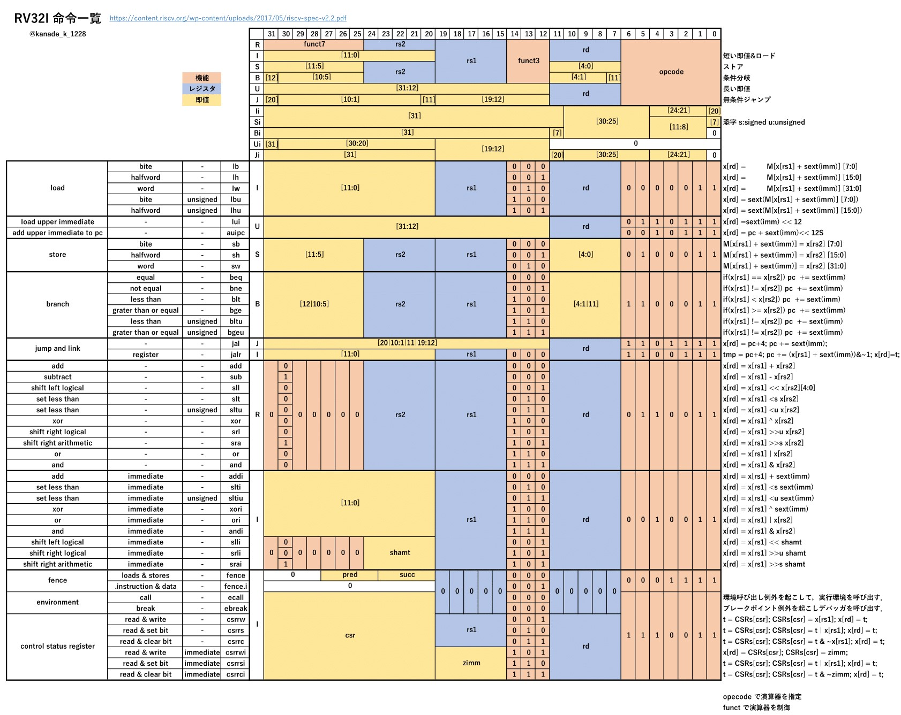

% RISC-V
% 
%

## RV32Iのアーキテクチャ

### レジスタ一覧

| id      | name   |                                                    |
| ------- | ------ | -------------------------------------------------- |
| x0      | zero   | 値はゼロで固定                                     |
| x1      | ra     | 戻りアドレス                                       |
| x2      | sp     | スタックポインタ                                   |
| x3      | gp     | グローバルポインタ                                 |
| x4      | tp     | スレッドポインタ                                   |
| x5~x7   | t0~t3  | 一時レジスタ（関数呼び出し前後で保持されない）     |
| x8      | fp     | フレームポインタ                                   |
| x8~x9   | s0~s1  | 保存レジスタ（関数呼び出し前後で保持される）       |
| x10~x11 | a0~a1  | 関数の引数/返値                                    |
| x12~x17 | a2~a7  | 関数の引数                                         |
| x18~x27 | s2~s11 | 保存レジスタ                                       |
| x28~x31 | t3~t6  | 一時レジスタ                                       |
|         | pc     | プログラムカウンタはレジスタとしてアクセスできない |

### 命令フォーマット

### ロード

` x[rd] = sext?( M[x[rs1] + sext(imm)] [7?15?31? : 0] ) `

b(byte)/h(halfword)/w(word)で，メモリから読み出す長さを決めます．

()signed/(u)unsignedで，メモリから持ってきた値を符号拡張するかを決めます．

### ストア

` M[ x[rs1] + sext(imm) ] = x[rs2] [7?15?31?:0] `

b(byte)/h(halfword)/w(word)で，メモリに書き込む長さを決めます．

### 分岐・ジャンプ

