## レジスタ

メモリ空間の上位16個(0x000x)をレジスタとして割り当てます。

| アドレス         |         | 機能                 |     |
| ---------------- | ------- | -------------------- | --- |
| **特殊レジスタ** |         |                      |     |
| 0x0000           | zero    | ゼロ固定             | R   |
| 0x0001           | ira     | 割り込み戻りアドレス | R   |
| 0x0002           | csr     | 状態制御レジスタ     | R/W |
| 0x0003           | sp      | スタックポインタ     | R&W |
| **汎用レジスタ** |         |                      |     |
| 0x0004           | ra      | 戻りアドレス         |     |
| 0x0005           | fp      | フレーム・ポインタ   |     |
| 0x0006 - 0x0007  | a0 - a1 | 引数戻値レジスタ     |     |
| 0x0008 - 0x000b  | t0 - t3 | 一時レジスタ         |     |
| 0x000c - 0x000f  | s0 - s3 | 保存レジスタ         |     |

　ロジックICでCPUを作る場合、レジスタは74HC564などのDフリップフロップを使用します。しかし、今回作るCPUはレジスタが多く(16個)、ロジックICの数が膨大(74HC564×32個)になってしまいます。そのため、このCPUでは、メインメモリのSRAMの一部を、レジスタとして使います。

　レジスタをSRAMとして実装する問題点として、レジスタの値をリアルタイムに取得できないという問題があります。多くの自作CPUは、レジスタの値を直接LEDで見れるようになっています。

　この問題を解消するため、メモリバースト転送という仕組みを実装します。
各クロックの最後のステージで、デバッガがRAMの内容を全て読み出します。
レジスタ値の変化をリアルタイムに見ることはできませんが、命令によるレジスタ値の変化を追跡することができます。

### 特殊レジスタ

　レジスタをSRAMとして実装すると述べましたが、SRAMの入出力ポートは１つしかないので、複数のレジスタ値を常に取得し続けることができないという問題があります。そのため、4個のレジスタはSRAMとは独立したDフリップフロップICで実装します。アドレスの上位12ビットが0の場合 `0b0000_0000_0000_00xx` SRAMのCE信号をOFFにして、DFFのCE信号をONにします。(CE:Chip Enable)

#### 0. ゼロ・レジスタ(zero)

常にゼロを返すレジスタです。

#### 1. 割り込み戻りアドレス(ira)

割り込みが発生したら、次のクロックでPCを割り込みのアドレス(0x0001)に変更し、割り込みの処理を行います。その時に、本来次に行くべきPCを退避しておくレジスタが、割り込みリターンアドレス (IRA : Interrupt Return Address) です。

#### 2. 状態制御レジスタ(csr)

|     | csr     |     |                  |
| --- | ------- | --- | :--------------- |
| 0   | ien     | W   | 割り込み許可     |
| 1-7 | i0 - i6 | R   | 0-6番割り込み    |
|     |         |     | 内部例外         |
| 8-f |         |     | 未定             |
| 8   | mode    |     | 特権モード（仮） |

#### 3. スタック・ポインタ(sp)

スタックの先頭を指したポインタです。

### 汎用レジスタ

0x0004-0x000fは、汎用レジスタです。汎用レジスタは、ハードウェア的にはどれも同じです。

汎用レジスタの用途は ABI (Application Binary Interface) で規定されています。詳細は関数呼び出しの項で。

#### 0. 戻りアドレス(ra)

関数の戻りアドレスを退避しておくレジスタです。

#### 1. フレームポインタ(fp)

関数フレームの基底アドレスを指したポインタです。

#### 2. 引数戻値レジスタ(a0-a1)

関数の引数を入れておくレジスタです。

#### 3. 一時レジスタ(t0-t3)

関数呼び出しの後で値が変化するレジスタです。

#### 4. 保存レジスタ(s0-s3)

関数側が関数の前後で値が変化しないことを保証するレジスタです。

## 命令セット

機械語的に見ると命令は `calc`,`calci`,`load`,`store`,`calif` の5種類です。しかし、アセンブラから見ると、??種類の命令があります。多くのアセンブラでは「疑似命令」と呼ばれるシンタックスシュガーを実装しています。例えば、RISC-Vでは、`add rd, rs, zero` を `mov rd, rs` と短縮して書くことができます。しかし、RKASMの疑似命令はシンタックスシュガーではありません。その特徴が一番現れているのが `calif` 命令です。`calif`をニーモニックとして使うことはできません。アセンブラ `if sa2 sa1 imm` は、内部的には `calif zero sa2 sa1 imm` と等価ですが、アセンブラ上で直接 `calif zero sa2 sa1 imm` と書くことはできません。別にこれを書けるようにしてもいいんですが、引数を4つも取ると、アセンブラが見にくくなるという問題があります。また実用上、引数4つをフルで使うことはない（どれかがzeroになる）ので、`calif`を直接呼び出せないようにしています。その代わりに、使い方に応じてニーモニック`if` `jump` `call` `ret` `iret` を割り当てています。これによって「生で書いてもわかりやすい＆バグりにくいアセンブラ」を実現します。

RK16の命令は「RAMから2回読み出し1回書き込む」という形式をとっています。これにより、全ての命令が同じステージ数で実行できるようになり、命令デコーダ (ID:Instruction Decoder) の回路を簡略化できます。

機械語命令は5種類あるので、命令ビットは 3 ビットで済むはずです。また、バイナリ中で最も多く出現する `mov` 命令は、意味のあるビットは 12/32 と、命令空間をかなり無駄遣いしています。つまり、この命令セットは情報量に対してかなり余剰なROM空間を消費するということになります。一般的に、特にROM空間が限られる組み込みにおいて、命令セットはバイナリ長が短くなるものが良いです。しかし、RKISAはロジックICで実装するために、ハードウェアの削減に重きをおいています。命令デコーダ(ID)の実装が楽になるように、あえて余分なビットを使っています。

### 演算命令

| 命令         | ASM             | 処理                 |
| :----------- | :-------------- | :------------------- |
| レジスタ演算 | add da sa1 sa2  | [da] = [sa1] + [sa2] |
| 即値演算     | addi da sa1 imm | [da] = [sa1] + imm   |

#### 算術演算

|     | 演算                 | ASM |                    |
| --- | :------------------- | --- | :----------------- |
| +   | 加算                 | add |                    |
| -   | 減算                 | sub |                    |
| &   | ビット AND           | and |                    |
| \|  | ビット OR            | or  |                    |
| ^   | ビット XOR           | xor |                    |
| ~   | ビット NOT           | not |                    |
| >>  | 右シフト（符号あり） | rss | シフトして符号拡張 |
| >>  | 右シフト（符号なし） | rsu | 0 埋め             |
| <<  | 左シフト             | ls  |                    |

#### 符号拡張 (Sign Extension) とは

　4bitの符号付き整数を8bitにしたい場合、正の数は`0`を埋めればいいですが、負の数は`1`を埋める必要になります。符号付き整数の符号は、最上位ビットで表されるので、一般に、符号付き整数のビット長を伸ばしたい場合、最上位ビットで埋める必要があります。これが符号拡張です。

| dec |      | bin      |
| --- | ---- | -------- |
| 1   | 0000 | 0001     |
|     | ↖    | **0**001 |
| 0   |      | 0000     |
|     | ↙    | **1**111 |
| -1  | 1111 | 1111     |

#### 比較演算

真偽型は、0x0000 のみを false とし、他は全て true とみなします。

|     | 演算                 | ASM   |                     |
| --- | :------------------- | ----- | :------------------ |
| ==  | 一致比較             | eq    |                     |
| <   | 大小比較（符号あり） | lts   | signed として比較   |
| <   | 大小比較（符号なし） | ltu   | unsigned として比較 |
|     | 論理キャスト         | lcast |                     |

比較演算は true = 0xFFFF false = 0x0000 を返します。
論理キャストは false(0x0000) 以外の値を 0xFFFF に変換します。
論理演算をビット演算で行えます。

### 転送命令

| 命令           | ASM               |                       |
| :------------- | :---------------- | :-------------------- |
| レジスタ間移動 | mov da sa         | [da] = [sa]           |
| 即値ロード     | loadi da imm      | [da] = imm            |
| メモリロード   | load da sa1 imm   | [da] = [[sa1] + imm]  |
| メモリストア   | store sa2 sa1 imm | [[sa1] + imm] = [sa2] |

ロード命令は、メモリからレジスタに値を移動します。
ストア命令は、レジスタからメモリに値を移動します。

メモリのアドレスは、レジスタに入ってる値と即値を足します。(mem[sa1 + imm])

### 制御命令

| 命令     | ASM        | 処理                                           |
| :------- | :--------- | :--------------------------------------------- |
| 条件呼出 |            | [da] = PC + 1, if([sa2] == 0) PC = [sa1] + imm |
| 条件分岐 | if sa2 imm | if([sa1] == 0) PC = imm                        |
| ジャンプ | jump imm   | PC = imm                                       |
| 関数呼出 | call imm   | [RA] = PC + 1, PC = imm                        |
| 関数復帰 | ret        | PC = [RA]                                      |
| 割込復帰 | iret       | PC = [IRA]                                     |

プログラムの制御に関する命令は全て `calif` で実行できます。
この命令を生で呼び出すことは想定していません。

#### 割り込み番号

| No  | 機能     |
| --- | -------- |
| 0   | リセット |
| 1   | 外部１   |
| 2   | 外部２   |
| 3   | 外部３   |
| 4   | タイマ１ |
| 5   | タイマ２ |
| 6   | タイマ３ |
| 7   | タイマ４ |

- Timer
- WDT (Watch Dog Timer)
- PWM
- DMA

## メモリ空間

メモリ空間は 0x1000 ごとに区切られていて、`CE` を使ってRAM以外のデバイスにスイッチできます。

| Address         | Function         |
| --------------- | :--------------- |
| 0x0000 - 0x000F | Registor         |
| 0x0010 - 0x00FF | IO Ctrl Registor |
| 0x1000 - 0x2FFF | VRAM             |
| 0x3000 - 0xFFFF | RAM              |

### IO

IOはSRAM とは別に Dual Port SRAM または DFF の IC を使って実装する。このアドレスへのメモリアドレスは、デバイスにスイッチ。

### VRAM (Dual access SRAM)

表示の候補として、

- 300 x 400 画素 x 白黒 2 段階 (1bit) = 120000 bit < 16bit x 8k
- テキスト表示（フォントを EEPROM に置いておく）

### RAM (SRAM)

### Program ROM (NOR Flash)

## 回路

### 命令の実行

RK16の命令は「RAMから2回読み出し1回書き込む」という形式をとっています。
これを4ステージで実行します。

| ステージ | `calc`                             | `calci`                            | `load`                            | `store`                           | `calif`                           |
| :------- | :--------------------------------- | :--------------------------------- | :-------------------------------- | :-------------------------------- | :-------------------------------- |
| 1.Load   | [sa1] => SR1                   | [sa1] => SR1 ALU(SR1,imm,func) | [sa1] => SR1 ALU(SR1,imm,add) | [sa1] => SR1 ALU(SR1,imm,add) | [sa1] => SR1 ALU(SR1,imm,add) |
| 2.Load   | [sa2] => SR2 ALU(SR1,SR2,func) |                                    | [ALU] => SR2                  | [sa2] => SR2                  | [sa2] => SR2 IS_ZERO(SR2)     |
| 3.Store  | ALU => [da]                        | ALU => [da]                        | SR2 => [da] ALU => SP         | SR2 => [ALU/SR1] ALU => SP    | PC+1 => [da]                      |
| 4.Dump   | PC+1 => PC                         | PC+1 => PC                         | PC+1 => PC                        | PC+1 => PC                        | IS_ZERO ? ALU : PC+1 => PC        |

命令に合わせて、各ステージの長さを調整することで、クロック（正確にはIPS）を上げられます。

## スタック

一般的なCPUでは、スタックの `pop` と `push` 命令があります。

実装してもいいかも。。。

## 関数呼び出し

関数呼び出しは、

## 割り込み

#### 1. 割り込み発生

割り込みは、割り込み入力ピン `i0`-`i7` を `1` にすることで発火できます。割り込み発生時に実行されている命令が終了したら、割り込み処理へ遷移します。

#### 2. 割り込み開始

実行中の命令が終了したら、割り込み処理へ移動します。

1. 次のPCをIRAに退避します。
2. PCを割り込みのアドレス(0x0001)にします。

#### 3. 割り込み禁止

割り込み処理中に割り込みが発生しないように、割り込み許可ビットを`0`にします。

#### 4. 割り込み処理の本体

割り込みの処理を行って、割り込みを解消します。

#### 5. 割り込み許可

割り込み処理から復帰する前に、割り込み許可ビットを`1`に戻します。変更が反映されるまで、ハードウェア的に1クロック遅延させています。割り込みから復帰する前に割り込みが発生すると、IRAが上書きされ、元の処理がわからなくなります。

#### 6. 割り込みから復帰

`iret` 命令で割り込みから元の処理に戻ります。

### 例外

- 外部要因：命令に非同期
  - 割り込み
- 内部要因：命令の結果として生じる
  - トラップ
    - OSシステムコールの呼び出しなど
  - フォールト
    - たぶん元の処理に戻る
  - アボート
    - たぶん元の処理に戻らない
