## レジスタ

| アドレス    |         | 機能                             | 保持 |
| ----------- | ------- | -------------------------------- | ---- |
| 0x00        | zero    | ゼロ固定                         | -    |
| 0x01        | ra      | 戻りアドレス                     | ✕    |
| 0x02        | sp      | スタック・ポインタ               | 〇   |
| 0x03        | gp      | グローバル・ポインタ             | 〇   |
| 0x04 - 0x07 | s0 - s3 | 保存レジスタ                     | 〇   |
| 0x08 - 0x0b | t0 - t3 | 一時レジスタ                     | ✕    |
| 0x0c - 0x0f | a0 - a3 | 引数・返値                       | ✕    |
| -           | pc      | プログラムカウンタ               | -    |
| -           | csr     | コントロール＆ステータスレジスタ | -    |

## 命令セット

| 命令           | アセンブリ        |                             |                          |
| -------------- | ----------------- | --------------------------- | ------------------------ |
| レジスタ演算   | add rd rs1 rs2    | rd = rs1 + rs2              |                          |
| 即値演算       | addi rd rs1 imm   | rd = rs1 + imm              | 即値は 12bit で符号拡張  |
| ロード         | load rd rs1 imm   | rd = mem[rs1 + imm]         | rs1 = zero で絶対参照    |
| ストア         | store rs1 rs2 imm | mem[rs1 + imm] = rs2        |                          |
| 即値ロード     | loadi rd imm      | rd = imm                    |                          |
| ジャンプ       | jump rd rs1 imm   | rd = PC + 1, PC = rs1 + imm | 戻りアドレスを rd に保存 |
| 条件分岐（＝） | breq rs1 rs2 imm  | if(rs1 = rs2) PC = imm      |                          |
| 条件分岐（＜） | brlt rs1 rs2 imm  | if(rs1 < rs2) PC = imm      |                          |

- `rx` はレジスタの値
- `mem[x]` はメモリの x 番地の値
- `imm` は即値

#### 符号拡張とは

4bit の符号付き整数を 8bit にしたい場合、正の数は 0 を埋めればいいですが、負の数は 1 を埋める必要になります。符号付き整数の符号は、最上位 bit で表されるので、一般に、符号付き整数の bit 長を伸ばしたい場合、最上位ビットで埋める必要があります。これが符号拡張です。

|     |      |          |
| --- | ---- | -------- |
| 1   | 0000 | 0001     |
| 1   | ↑↑↑← | **0**001 |
| 0   |      | 0000     |
| -1  | ↓↓↓← | **1**111 |
| -1  | 1111 | 1111     |

### 演算の種類

| No  |     | 演算 | No  |     | 演算                         |                                    |
| --- | --- | ---- | --- | --- | ---------------------------- | ---------------------------------- |
| 0   | +   | add  | 6   | <   | lt (less than)               |                                    |
| 1   | -   | sub  | 7   | <   | ltu (less than unsigned)     | 符号なし整数として比較             |
| 2   | &   | and  | 8   | >>  | rsl (right shift logical)    | 上位ビットを符号ビットで埋める     |
| 3   | \|  | or   | 9   | >>  | rsa (right shift arithmetic) | 上位ビットを 0 で埋めする          |
| 4   | ^   | xor  | A   | <<  | ls (left shift)              | left shift 下位ビットは 0 で埋める |
| 5   | ~   | not  | B   |     |                              |                                    |

### 割り込み

割り込みとしてエラー処理を行う。

エラーコードを状態レジスタにセットし割り込み。

- スタックオーバーフロー
- メモリの範囲外アクセス

## メモリ空間

| Addr            | Function |
| --------------- | -------- |
| 0x0000 - 0x003F | レジスタ |
| 0x0040 - 0x00FF | GPIO     |
| 0x1000 - 0x1FFF | VRAM     |
| 0x2000 - 0xFFFF | RAM      |

### レジスタ

- 実体としては、SRAM の一部分
- 6bit でアクセスする → ISA でビットを節約できる

### IO

IO は SRAM とは別に Dual Port SRAM または DFF の IC を使って実装する。このアドレスへのメモリアドレスは、デバイスにスイッチ。

### VRAM (Dual access SRAM)

表示の候補として、

- 300 x 400 画素 x 白黒 2 段階 (1bit) = 120000 bit ~ 16bit x 8k
- テキスト表示（フォントを EEPROM に置いておく）

### RAM (SRAM)

### Program ROM (NOR Flash)

## 回路

### ID

命令デコーダ。機械語命令をもとに、マルチプレクサを切り替えて、データの経路を決める。

4 クロックで 1 命令を実行する。

1. メモリを読み出し、RS1 に記録
2. メモリを読み出し、RS2 に記録
3. メモリに書き込み
4. PC のカウントアップ

|       | ALU  | S2  | DIN | 1.R ADR | 2.R ADR | 3.W ADR |
| ----- | ---- | --- | --- | ------- | ------- | ------- |
| add   | Func | RS2 | ALU | RS1     | RS2     | RD      |
| addi  | Func | IMM | ALU | RS1     | -       | RD      |
| load  | ADD  | IMM | RS2 | RS1     | ALU     | RD      |
| store | ADD  | IMM | RS2 | RS1     | RS2     | ALU     |
| loadi | -    | -   | IMM | -       | -       | RD      |
| jump  | ADD  | IMM | PC  | RS1     | -       | RD      |
| be    | SUB  | RS2 | -   | RS1     | RS2     | 0       |
| bl    | SUB  | RS2 | -   | RS1     | RS2     | 0       |

### ALU

### クロック

### PFC

プログラムフローコントローラ。ジャンプ命令、分岐命令、割り込みによる、プログラムの流れの変化を処理します。

|      | 次の PC            |
| ---- | ------------------ |
| -    | PC+1               |
| be   | ALU=0 ? IMM : PC+1 |
| bl   | ALU>0 ? IMM : PC+1 |
| jump | ALU                |
