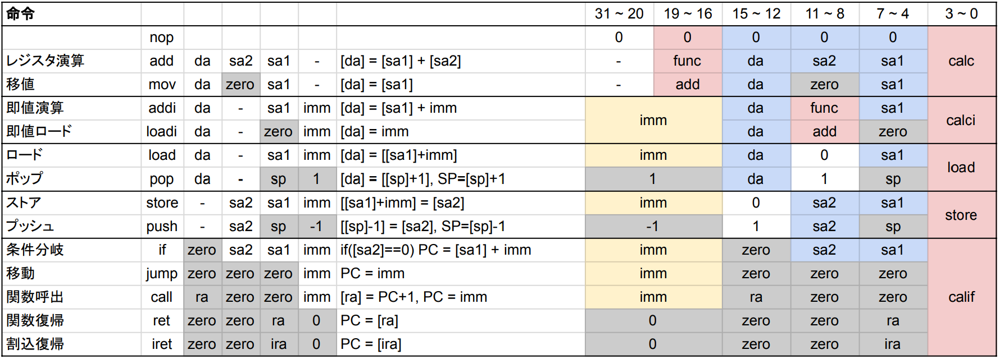

## レジスタ

レジスタはSRAMの一部として実装します。

| アドレス    |         | 機能                 |     |
| ----------- | ------- | -------------------- | --- |
| 0x00        | zero    | ゼロ固定             | R   |
| 0x01        | pc      | プログラムカウンタ   | R   |
| 0x02        | ira     | 割り込み戻りアドレス | R   |
| 0x03        | csr     | 状態制御レジスタ     | RW  |
| 0x04        | ra      | 戻りアドレス         | ✕   |
| 0x05        | sp      | スタック・ポインタ   | 〇  |
| 0x06        | fp      | フレーム・ポインタ   | 〇  |
| 0x07        |         |                      | 〇  |
| 0x08 - 0x0b | s0 - s3 | 保存レジスタ         | 〇  |
| 0x0c - 0x0f | t0 - t3 | 一時レジスタ         | ✕   |

## 命令セット



- `rx` はレジスタの値
- `mem[x]` はメモリの x 番地の値
- `imm` は即値

### 演算命令

| 命令         | ASM             | 処理           |
| ------------ | --------------- | -------------- |
| レジスタ演算 | add rd rs1 rs2  | rd = rs1 + rs2 |
| 即値演算     | addi rd rs1 imm | rd = rs1 + imm |

#### 算術演算

|     | 演算                 | ASM |                    |
| --- | -------------------- | --- | ------------------ |
| +   | 加算                 | add |                    |
| -   | 減算                 | sub |                    |
| &   | ビット AND           | and |                    |
| \|  | ビット OR            | or  |                    |
| ^   | ビット XOR           | xor |                    |
| ~   | ビット NOT           | not |                    |
| >>  | 右シフト（符号あり） | rss | シフトして符号拡張 |
| >>  | 右シフト（符号なし） | rsu | 0 埋め             |
| <<  | 左シフト             | ls  |                    |

#### 符号拡張 (Sign Extension) とは

4bit の符号付き整数を 8bit にしたい場合、正の数は 0 を埋めればいいですが、負の数は 1 を埋める必要になります。
符号付き整数の符号は、最上位 bit で表されるので、一般に、符号付き整数の bit 長を伸ばしたい場合、最上位ビットで埋める必要があります。
これが符号拡張です。

|     |      |          |
| --- | ---- | -------- |
| 1   | 0000 | 0001     |
|     | ↑↑↑← | **0**001 |
| 0   |      | 0000     |
|     | ↓↓↓← | **1**111 |
| -1  | 1111 | 1111     |

#### 比較演算

真偽型は、0x0000 のみを false とし、他は全て true とみなします。

|     | 演算                 | ASM   |                     |
| --- | -------------------- | ----- | ------------------- |
| ==  | 一致比較             | eq    |                     |
| <   | 大小比較（符号あり） | lts   | signed として比較   |
| <   | 大小比較（符号なし） | ltu   | unsigned として比較 |
|     | 論理キャスト         | lcast |                     |

比較演算は true = 0xFFFF false = 0x0000 を返します。
論理キャストは false(0x0000) 以外の値を 0xFFFF に変換します。
論理演算をビット演算で行えます。

### 移値命令

| 命令           | ASM               |                      |
| -------------- | ----------------- | -------------------- |
| アドレス間移動 | mov rd rs         | rd = rs              |
| 即値ロード     | loadi rd imm      | rd = imm             |
| メモリロード   | load rd rs1 imm   | rd = mem[rs1 + imm]  |
| メモリストア   | store rs2 rs1 imm | mem[rs1 + imm] = rs2 |

ロード命令は、メモリからレジスタに値を移動します。
ストア命令は、レジスタからメモリに値を移動します。

メモリのアドレスは、レジスタに入ってる値と即値を足します。(mem[rs1 + imm])

### 制御命令

| 命令     | ASM        | 処理                                     |
| -------- | ---------- | ---------------------------------------- |
| 条件呼出 |            | rd = PC + 1, if(rs2 == 0) PC = rs1 + imm |
| 条件分岐 | if rs2 imm | if(rs1 == 0) PC = imm                    |
| ジャンプ | jump imm   | PC = imm                                 |
| 関数呼出 | call imm   | ra = PC + 1, PC = imm                    |
| 関数復帰 | ret        | PC = ra                                  |
| 割込復帰 | iret       | PC = ira                                 |

プログラムの制御に関する命令は全てこれで実行できます。
この命令を生で呼び出すことは想定していません。
後述する疑似命令を使います。

### 割り込み

割り込みは関数呼び出しとほとんど同じです。
唯一の違いは、戻りアドレスをRAではなくIRAに保存する点です。


1. 割り込み発生
2. 現在実行中の命令が終了したら
3. 次のPCをIRAに退避し、PCを割り込み命令アドレス0x0001にする
4. 割り込み禁止
5. 割り込み処理を実行
6. 割り込み許可（１クロック遅延）
7. 割り込み復帰
8. 元の処理を実行


#### 割り込み番号

| No  | 機能     |
| --- | -------- |
| 0   | リセット |
| 1   | 外部１   |
| 2   | 外部２   |
| 3   | 外部３   |
| 4   | タイマ１ |
| 5   | タイマ２ |
| 6   | タイマ３ |
| 7   | タイマ４ |

- Timer
- WDT (Watch Dog Timer)
- PWM
- DMA

## メモリ空間

メモリ空間は 0x1000 ごとにバンクに区切られていて、RAM以外のデバイスに置き換えられる。

| Addr            | Function         |
| --------------- | ---------------- |
| 0x0000 - 0x000F | Registor         |
| 0x0010 - 0x00FF | IO Ctrl Registor |
| 0x1000 - 0x2FFF | VRAM             |
| 0x3000 - 0xFFFF | RAM              |

### レジスタ

- 実体としては、SRAM の一部分
- 4bit でアクセスする → ISA でビットを節約できる

### IO

IO は SRAM とは別に Dual Port SRAM または DFF の IC を使って実装する。このアドレスへのメモリアドレスは、デバイスにスイッチ。

### VRAM (Dual access SRAM)

表示の候補として、

- 300 x 400 画素 x 白黒 2 段階 (1bit) = 120000 bit ~ 16bit x 8k
- テキスト表示（フォントを EEPROM に置いておく）

### RAM (SRAM)

### Program ROM (NOR Flash)

## 回路


### ID

命令デコーダ。機械語命令をもとに、マルチプレクサを切り替えて、データの経路を決める。


4 クロックで 1 命令を実行する。

1. メモリを読み出し、RS1 に記録
2. メモリを読み出し、RS2 に記録
3. メモリに書き込み
4. PC のカウントアップ

```{.verilog filename="ID.v"}
`define CALC  4'b0000
`define CALCI 4'b0001
`define LOAD  4'b0011
`define STORE 4'b0111
`define CALIF 4'b1111

module ID(
    input  wire [31: 0] OP,
    output wire [ 3: 0] RS1,
    output wire [ 3: 0] RS2,
    output wire [ 3: 0] RD,
    output wire [31:16] IMM,
    output wire [ 1: 0] DIN_SEL,
    output wire [ 1: 0] ADDR_SEL,
    output wire [ 3: 0] ALU_CTRL,
    output wire         PFC_CTRL,
);

wire [3:0] OPC;

assign RS1 = OP[ 3: 0];
assign RS2 = OP[ 7: 4];
assign RD  = OP[11: 8];
assign OPC = OP[15:12];
assign IMM = OP[31:16];

assign ALU_CTRL = OPC==`CALC  ? OP[19:16]
                : OPC==`CALCI ? OP[ 7: 4]
                : `ALU_ADD;

assign ADDR_SEL = STAGE==0 ? `ADDR_RS1
                : STAGE==1 ? `ADDR_RS2
                : STAGE==2 ? `ADDR_RD;

assign DIN_SEL = OPC==`CALC|`CALCI ? `DIN_ALU 
               : OPC==`LOAD|`STORE ? `DIN_RS2
               : OPC==`CALLIF     ? `DIN_RA;

assign S2_SEL = OPC==`CALC ? `S2_RS2 
                           : `S2_IMM;

endmodule
```

|        | ALU  | S2  | DIN | 1.ADR | 2.ADR | 3.ADR |
| ------ | ---- | --- | --- | ----- | ----- | ----- |
| add    | Func | RS2 | ALU | RS1   | RS2   | RD    |
| addi   | Func | IMM | ALU | RS1   | -     | RD    |
| load   | ADD  | IMM | RS2 | RS1   | ALU   | RD    |
| store  | ADD  | IMM | RS2 | RS1   | RS2   | ALU   |
| callif | ADD  | IMM | RA  | RS1   | RS2   | RD    |


### ALU

演算装置。必要な演算は、

|     | 演算                 | 実装           |
| --- | -------------------- | -------------- |
| +   | 加算                 | 74181          |
| -   | 減算                 | 74181          |
| &   | ビット AND           | 74181          |
| \|  | ビット OR            | 74181          |
| ^   | ビット XOR           | 74181          |
| ~   | ビット NOT           | 74181          |
| >>  | 右シフト（符号あり） | MUX            |
| >>  | 右シフト（符号なし） | MUX            |
| <<  | 左シフト             | 74181          |
| ==  | 一致比較             | 7485           |
| <   | 大小比較（符号あり） | 7485           |
| <   | 大小比較（符号なし） | 7485 + MSB NOT |

74HC181 で実装する。

| 74181 | Cn  | M   | S~3~ | S~2~ | S~1~ | S~0~ |
| ----- | --- | --- | ---- | ---- | ---- | ---- |
| ADD + | 0   | 0   | 1    | 0    | 0    | 1    |
| SUB - | 1   | 0   | 0    | 1    | 1    | 0    |
| AND & | -   | 1   | 1    | 1    | 1    | 0    |
| OR \| | -   | 1   | 1    | 0    | 1    | 1    |
| XOR ^ | -   | 1   | 1    | 0    | 0    | 1    |
| NOT ~ | -   | 1   | 0    | 0    | 0    | 0    |

### クロック


### PFC

プログラムフローコントローラ。プログラムの流れの変化を処理します。


