| 演算         |                     |     | 演算               |        |     |
| :----------- | :------------------ | --- | :----------------- | :----- | --- |
| **74181**    |                     |     | **比較回路**       |        |     |
| 加算         | `A+B` (mod 0x10000) | add | 一致               | `A==B` | eq  |
| 減算         | `A-B` (mod 0x10000) | sub | 不一致             | `A!=B` | neq |
| 論理積       | `A&B`               | and | 比較(signed)       | `A<B`  | lts |
| 論理和       | `A\|B`              | or  | 比較(unsigned)     | `A<B`  | lsu |
| 排他的論理和 | `A^B`               | xor | **シフト回路**     |        |     |
| 論理否定     | `~A`                | not | 右シフト(signed)   | `A>>1` | srs |
| 左シフト     | `A>>1`              | sl  | 右シフト(unsigned) | `A>>1` | sru |

## 真偽演算

　真偽値は`0xffff`が`true`、`0x0000`が`false`です。

### 一致/不一致

　74181には `A=B` 出力があります。これと制御信号を XOR して eq A B / neq A B を計算し、16bitに広げてbool型に変換します。

### 大小比較

　比較には減算のキャリー出力と符号ビットを使います。まず、4bitの符号なし整数の減算 $A-B$ を考えます。ビット反転して1を足すと負の数になる ($10000-X=\bar{X}+1$) という特性を利用して計算します。

$$
A-B=A+(10000-B)-10000=A+\bar{B}+1-10000
$$

　減算器は $A+\bar{B}+1$ を計算する回路です。

$$
A+\bar{B}+1=A-B+10000
$$

　キャリー出力は結果が10000以上であることを表しています。つまり、減算器のキャリーフラグが立っているとき、

$$
A+\bar{B}+1=A-B+10000 \geq 10000 \Rightarrow A \geq B
$$

を意味しています。逆にフラグが立っていない場合、

$$
A < B
$$

ということになります。

| A:B | Carry |
| --- | ----- |
| A>B | 1     |
| A=B | 1     |
| A<B | 0     |

　符号つき整数の場合、符号ビットを反転してから同じことをやれば比較ができます。「符号ビットを反転し符号なし整数として解釈する」という操作は、大小関係を保存するからです。

## 設計

マルチプレクサ(74HC175)かトライステートバッファ(74HC541)か。
遅延はデータシート上ではどちらも 10 ns っぽい。

## 実装

- [74HC181](./doc/74HC181.pdf)
- [74HC182](./doc/74HC182.pdf)

を組み合わせて使います！高速ALU！

## テスト
