## 機能

| 機能               |       |
| ------------------ | ----- |
| 加算               | add   |
| 減算               | sub   |
| 論理積             | and   |
| 論理和             | or    |
| 排他的論理和       | xor   |
| 論理否定           | not   |
| 左シフト           | sl    |
| 等値               | eq    |
| 比較(signed)       | lts   |
| 比較(unsigned)     | ltu   |
| 論理キャスト       | lcast |
| 右シフト(signed)   | srs   |
| 右シフト(unsigned) | sru   |

## 設計

マルチプレクサ(74HC175)かトライステートバッファ(74HC541)か。
遅延はデータシート上ではどちらも 10 ns っぽい。

## 実装

- [74HC181](./doc/74HC181.pdf)
- [74HC182](./doc/74HC182.pdf)

を組み合わせて使います！高速ALU！

## テスト
