## 演算器

演算の種類

| 演算         |                   |     | 演算               |      |     |
| :----------- | :---------------- | --- | :----------------- | :--- | --- |
| **74181**    |                   |     | **比較回路**       |      |     |
| 加算         | A+B (mod 0x10000) | add | 一致               | A==B | eq  |
| 減算         | A-B (mod 0x10000) | sub | 不一致             | A!=B | neq |
| 論理積       | A&B               | and | 比較(signed)       | A<B  | lts |
| 論理和       | A\|B              | or  | 比較(unsigned)     | A<B  | lsu |
| 排他的論理和 | A^B               | xor | **シフト回路**     |      |     |
| 論理否定     | ~A                | not | 右シフト(signed)   | A>>1 | srs |
| 左シフト     | A<<1              | sl  | 右シフト(unsigned) | A>>1 | sru |

  
比較演算の原理

　比較演算の結果は真偽値型です。結果は1bitなので16bitに広げます。（`true`→`0xffff`、`false`→`0x0000`）

#### 一致/不一致

　74181には `A=B` 出力があります。これと制御信号を XOR すると eq A B / neq A B になります。

#### 大小比較

　比較には74181の減算を使います。まず、4bitの符号なし整数の減算 $A-B$ を考えます。ビット反転して1を足すと負の数になる ($10000-X=\overline{X}+1$) ことを利用して計算します。

$$
A-B=A+(10000-B)-10000=A+\overline{B}+1-10000
$$

　減算器は実際には加算 $A+\overline{B}+1$ を計算します。キャリー出力は結果が10000以上であることを表しています。つまり、減算器のキャリーフラグが立っているとき、

$$
A+\overline{B}+1=A-B+10000 \geq 10000 \Rightarrow A \geq B
$$

| 74181     | A<B | A=B | A>B |
| --------- | --- | --- | --- |
| **Carry** | 0   | 1   | 1   |
| **A=B**   | 0   | 1   | 0   |

　符号つき整数の場合、符号ビットを反転してから同じことをやれば比較ができます。「符号ビットを反転し符号なし整数として解釈する」という操作は、大小関係を保存するからです。

部品表

| BOM                |                              | #   |
| :----------------- | ---------------------------- | --- |
| ALU                | [74HC181](./doc/74HC181.pdf) | 4   |
| Carry              | [74HC182](./doc/74HC182.pdf) | 1   |
| XOR                | [74HC86](./doc/74HC86.pdf)   | 1   |
| 4 to 16 Decoder    | [74HC154](./doc/74HC154.pdf) | 1   |
| 3 State Buffer     | [74HC541](./doc/74HC540.pdf) | 2   |
| 3 State Buffer Inv | [74HC540](./doc/74HC540.pdf) | 4   |
| OR                 | 74HC12                       | 1   |
| NAND (1bit MUX)    | 74HC00                       | 1   |

1bitのマルチプレクサは4個のNANDで構成できます。

$$
MUX = A \cdot S + B \cdot \overline{S} = \overline{\overline{A \cdot S}\cdot\overline{A\cdot\overline{S}}}
$$

## メモリ空間

タイミングチャート

#### SRAM

#### レジスタ

#### カウンタ

部品表

| BOM             |                              | #   |
| :-------------- | ---------------------------- | --- |
| 4 to 16 Decoder | [74HC154](./doc/74HC154.pdf) | 3   |
| 2 to 4 Decoder  | [74HC139](./doc/74HC139.pdf) | 1   |

## データパス

## NPC

部品表

| BOM         |                                | #   |
| :---------- | ------------------------------ | --- |
| Multiplexer | [74HC157](./doc/74HC154.pdf)   | 8   |
| Adder       | [74HC283](./doc/74HC283.pdf)   | 4   |
| DFF         | [74HC574](./doc/74HC564.pdf)   | 4   |
| 8in OR      | [74HC4078](./doc/74HC4078.pdf) | 2   |

## クロック

## デコーダ

