| op   |     |     |     |                      |
| ---- | --- | --- | --- | -------------------- |
| add  | rd  | rs1 | rs2 | R[rd]=R[rs1]+R[rs2]  |
| addi | rd  | rs1 | imm | R[rd]=R[rs1]+imm     |
| mov  | imm | rs1 | rs2 | R[rs1+imm]=R[rs2]    |
| br   | imm | rs1 | rs2 | if(rs1=rs2) PC = imm |

| op   | Stage 0      | Stage 1      | Stage 2      | Stage 3                | S2=  | D = STG2 & | ADDR=STG0& |
| ---- | ------------ | ------------ | ------------ | ---------------------- | ---- | ---------- | ---------- |
| add  | rs1 = R[rs1] | rs2 = R[rs2] | R[rd] = alu  | pc++                   | RS2  | ALU        | RS1        |
| addi | rs1 = R[rs1] | -            | R[rd] = alu  | pc++                   | IMM2 | ALU        | RS1        |
| mov  | rs1 = R[rs1] | rs2 = R[rs2] | R[alu] = rs2 | pc++                   | IMM0 | RS2        | RS1        |
| br   | rs1 = R[rs1] | rs2 = R[rs2] | -            | pc = flag ? imm : pc++ | RS2  | -          |

| op   | S2=!RS2 | S2=!IMM0 | S2=!IMM2 | ADDR=RS1 | ADDR=RS2 | ADDR=RD   | D = STG2 & | ADDR=STG0& |
| ---- | ------- | -------- | -------- | -------- | -------- | --------- | ---------- | ---------- |
| add  | 0       | 1        | 1        | STG0     | STG1     | STG2 & RD |            |            |
| addi | 1       | 1        | 0        | STG0     | STG1     | STG2 & RD |            |            |
| mov  | 1       | 0        | 1        | STG0     | STG1     |           |            |            |
| br   | 0       | 1        | 1        | STG0     | -        |           |            |            |

| 品番                     | 個数 | 用途               |                                                       |
| ------------------------ | ---- | ------------------ | ----------------------------------------------------- |
| 74HC139 2to4 デコーダ    | 2    |                    |                                                       |
| 74HC161 バイナリカウンタ | 2    | プログラムカウンタ |                                                       |
| 74HC175 4bit DFF         | 1    | ステージカウンタ   |                                                       |
|                          |      |                    |                                                       |
| 分周器付き発振器         | 1    | クロック           | [秋月](https://akizukidenshi.com/catalog/g/gP-01685/) |
| 押しボタンスイッチ（赤） | 1    | 手動クロック       | [秋月](https://akizukidenshi.com/catalog/g/gP-11669/) |
| 押しボタンスイッチ（黒） | 1    | リセット           |                                                       |
| 切り替えスイッチ         | 1    | クロック切り替え   |                                                       |
| スライドスイッチ         | 4    | 周波数選択         |                                                       |
