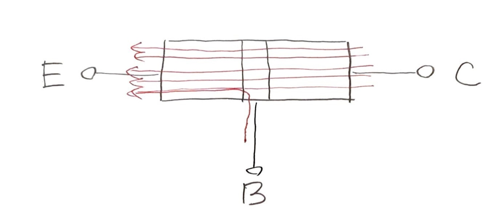

% 2 日目 リレーで計算をしてみる
%
%

これは [リレーから始める CPU 自作 Advent Calendar 2021](https://adventar.org/calendars/7052) 2 日目の記事です。

## 方針

「コンピュータの動作」を「電流がどう流れるのか」という回路のレベルから理解することがこの連載の目標です。

コンピュータのしくみを電気回路のレベルから理解しようとすると、「トランジスタ → 論理回路 → コンピュータ」という段階を経ることになるわけですが、最初の「トランジスタ」が厄介なんです。トランジスタの動作はよくこういう図で説明されます。

BE 間に電流が流れると、それに引っ張られるように CE 間で電流が流れる！

この図だけで

これでトランジスタ完全理解したという賢い

トランジスタをちゃんと理解しようとすると、量子力学とかいう複雑で直観的な描像が成り立たない物理が出てきて、難しいです。 （ちゃんと理解したい方には、慶応大の伊藤塾長の講義動画 [慶應大学講義　半導体工学　第一回](https://youtu.be/jwQY0vOAiOQ) がおすすめです。）

「結局トランジスタってなんなんだろう」というもやもやを残したまま、トランジスタをブラックボックスとして受け入れて、論理回路の話に進むわけです。

リレーコンピュータはトランジスタの代わりにリレーを使っているので、そのようなもやもやは一切ありません。リレーとは、スイッチを電磁石で動かす

「スイッチ」と「電磁石」

この連載では、トランジスタこそ使わないものの、

リレーコンピュータは、現在のトランジスタコンピュータは全然異なりますが、それらには共通する

「トランジスタ → 論理回路 → コンピュータ」を「リレー → 論理回路 → コンピュータ」と置き換えただけです。

一方で、論理回路の世界は単純明快なパズルです。

コンピュータがパズルの組み合わせであることを

「計算機とは何か？」という問いに、
