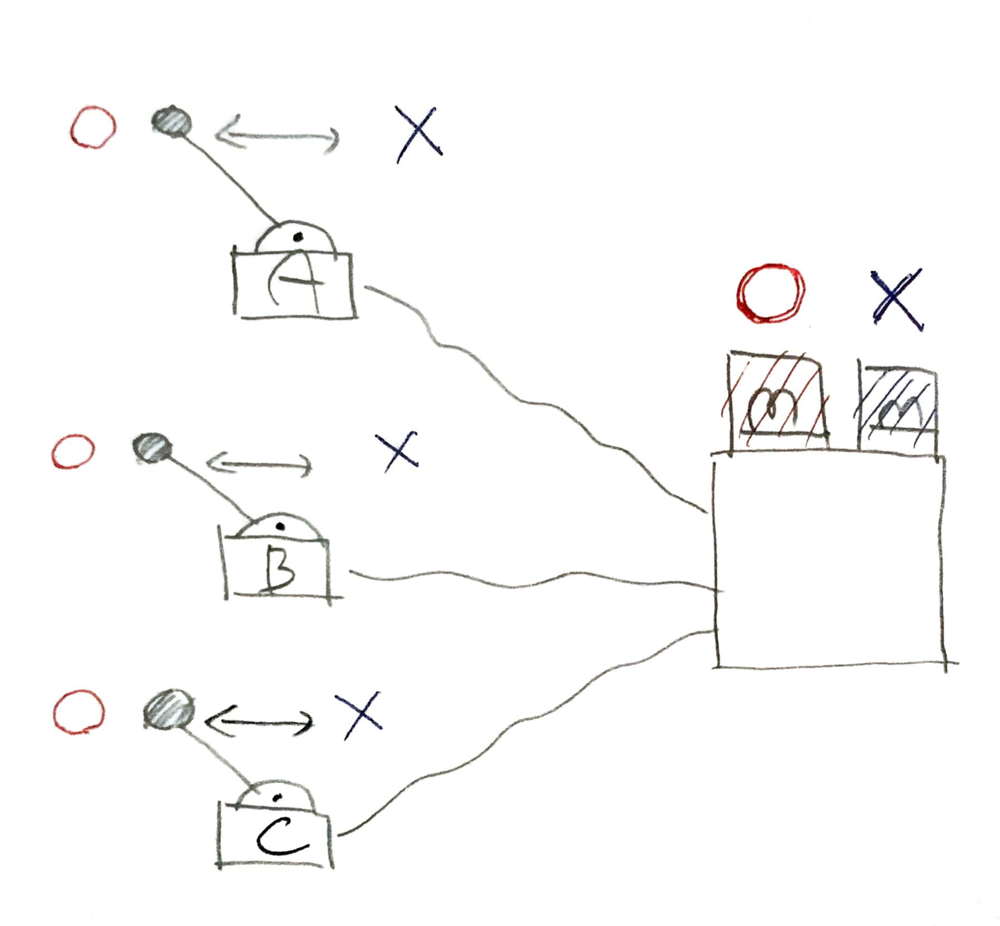
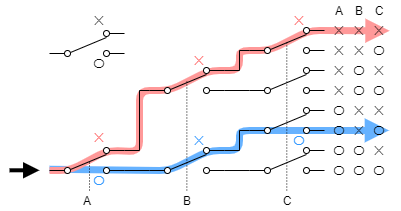

% スイッチで作る組合回路
%
% 2021-12-02

これは [リレーから始める CPU 自作 Advent Calendar 2021](https://adventar.org/calendars/7052) 2 日目の記事です。

## 多数決スイッチを作る

ABC の 3 人で ○ × の多数決をする回路を作ってみましょう。

ABC はそれぞれ手持ちのスイッチで ○ × を投票します。多い方のランプが点灯します。

（「多いほうが点灯する」という要求機能は、そのまま回路に実装するには抽象的すぎるので、）愚直に全パターン書き出してみると、

| A   | B   | C   | 結果 |
| --- | --- | --- | ---- |
| ×   | ×   | ×   | ×    |
| ×   | ×   | ○   | ×    |
| ×   | ○   | ×   | ×    |
| ×   | ○   | ○   | ○    |
| ○   | ×   | ×   | ×    |
| ○   | ×   | ○   | ○    |
| ○   | ○   | ×   | ○    |
| ○   | ○   | ○   | ○    |

これを、スイッチで実装すると、こういう回路になります。

※　点線で繋がっているスイッチは連動しています。

## マルチプレクサ

この部分をマルチプレクサといいます。

ABC 8 通りの組み合わせに対応した端子が導通するようになっています。

スイッチの分岐をたどって、動作を確認してみてください！

## 真理値表

入力と出力の一覧表を「真理値表」といいます。

|  A  |  B  |  C  | 出力 |
| :-: | :-: | :-: | :--: |
|  ×  |  ×  |  ×  |  ?   |
|  ×  |  ×  |  ○  |  ?   |
|  ×  |  ○  |  ×  |  ?   |
|  ×  |  ○  |  ○  |  ?   |
|  ○  |  ×  |  ×  |  ?   |
|  ○  |  ×  |  ○  |  ?   |
|  ○  |  ○  |  ×  |  ?   |
|  ○  |  ○  |  ○  |  ?   |

? に ○ × を当てはめる方法は $2^8=64$ パターンあります。つまり、（3 入力の）真理値表は全部で 64 パターンあります。マルチプレクサを使うことで、この 64 パターン全部を簡単に作ることができます。

## 組合回路

同じ入力に対して同じ出力となる回路を組合回路といいます。（これに対して、時と場合によって出力が異なる回路を順序回路といいます。）

組合回路の動作は、全パターンの入力に対する出力の一覧表、真理値表として書き表すことができます。逆に、ある真理値表を満たす回路をマルチプレクサを使うことで必ず作ることができます。

マルチプレクサを使うことで、”原理的に” 全ての組合回路を作れるようになります。

現実的には、マルチプレクサで組合回路を作ることは非効率です。マルチプレクサは、入力の数の増加に対して指数オーダーで回路が大きくなります。回路が大きくなればなるほど、信号の遅延やコストが増大するという問題が生じます。回路を簡単にする方法として「カルノー図」というものがあったりします。

## 次回予告

本章ではスイッチを入力とした組合回路を作りましたが、人間が手でスイッチを操作しないといけないという問題があります。

なので次章では、人間の手でなく電気で切り替えられるスイッチ、「リレー」を使って、組合回路を作ります。

> [>>> 次](../Day3_RelayLogic/)
