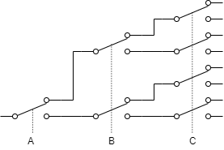

% スイッチで作る論理回路
%
%

## 多数決スイッチを作る

ABC の 3 人で ○ × の多数決をする回路を作ってみましょう。

ABC はそれぞれ手持ちのスイッチで ○ × を投票します。多い方のランプが点灯します。

とりあえず愚直に全パターン書き出してみると、

| A   | B   | C   | 結果 |
| --- | --- | --- | ---- |
| ×   | ×   | ×   | ×    |
| ×   | ×   | ○   | ×    |
| ×   | ○   | ×   | ×    |
| ×   | ○   | ○   | ○    |
| ○   | ×   | ×   | ×    |
| ○   | ×   | ○   | ○    |
| ○   | ○   | ×   | ○    |
| ○   | ○   | ○   | ○    |

これを、スイッチで作ってみましょう。

8 通りの

## 組合回路完全に理解した

おめでとうございます！ ”原理的に” 全ての組合回路を作れるようになりました！

ひとつ問題があるとすれば、人間が手でスイッチを操作しないといけないというところです。

なので次回は、人間の手でなく電気で切り替えられるスイッチ、「リレー」を使って、組合回路を作ります。

## 余談：論理ってなんやねん

「論理」というと、日常的には「論理的」とか「永田町の論理」とか、理屈という意味で使われることが多いですが、論理回路の論理は数学用語です。

数学における論理は、日常的な感覚とは少し違っている部分があります。

たとえば、

A かつ B ならば C
