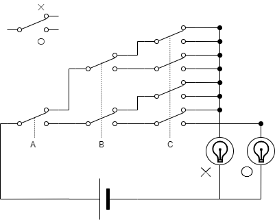

% スイッチで作る組合回路
%
% 2021-12-02

## 多数決スイッチを作る

ABC の 3 人で ○ × の多数決をする回路を作ってみましょう。

ABC はそれぞれ手持ちのスイッチで ○ × を投票します。多い方のランプが点灯します。

（「多いほうが点灯する」という要求機能は、そのまま回路に実装するには抽象的すぎるので、）愚直に全パターン書き出してみると、

| A   | B   | C   | 結果 |
| --- | --- | --- | ---- |
| ×   | ×   | ×   | ×    |
| ×   | ×   | ○   | ×    |
| ×   | ○   | ×   | ×    |
| ×   | ○   | ○   | ○    |
| ○   | ×   | ×   | ×    |
| ○   | ×   | ○   | ○    |
| ○   | ○   | ×   | ○    |
| ○   | ○   | ○   | ○    |

これを、スイッチで実装すると、こういう回路になります。

※　点線で繋がっているスイッチは連動しています。

## マルチプレクサ

この部分をマルチプレクサといいます。

ABC 8 通りの組み合わせに対応した端子が導通するようになっています。

スイッチの分岐をたどって、動作を確認してみてください！

## 全会一致

多数決回路をちょっと改造すると、全会一致か判断する回路も作れます。

|  A  |  B  |  C  | 多数決 | 全会一致 |
| :-: | :-: | :-: | :----: | :------: |
|  ×  |  ×  |  ×  |   ×    |    ×     |
|  ×  |  ×  |  ○  |   ×    |    ×     |
|  ×  |  ○  |  ×  |   ×    |    ×     |
|  ×  |  ○  |  ○  |   ○    |    ×     |
|  ○  |  ×  |  ×  |   ×    |    ×     |
|  ○  |  ×  |  ○  |   ○    |    ×     |
|  ○  |  ○  |  ×  |   ○    |    ×     |
|  ○  |  ○  |  ○  |   ○    |    ○     |

## 真理値表

入力と出力の一覧表を「真理値表」といいます。

|  A  |  B  |  C  | 出力 |
| :-: | :-: | :-: | :--: |
|  ×  |  ×  |  ×  |  ?   |
|  ×  |  ×  |  ○  |  ?   |
|  ×  |  ○  |  ×  |  ?   |
|  ×  |  ○  |  ○  |  ?   |
|  ○  |  ×  |  ×  |  ?   |
|  ○  |  ×  |  ○  |  ?   |
|  ○  |  ○  |  ×  |  ?   |
|  ○  |  ○  |  ○  |  ?   |

? に ○ × を当てはめる方法は $2^8=64$ パターンあります。つまり、（3 入力の）真理値表は全部で 64 パターンあります。

マルチプレクサを使うことで、この 64 パターン全部を簡単に作ることができます。

## 組合回路完全に理解した！

マルチプレクサを使うことで、”原理的に” 全ての組合回路を作れるようになります。

ひとつ問題があるとすれば、人間が手でスイッチを操作しないといけないというところです。

なので次回は、人間の手でなく電気で切り替えられるスイッチ、「リレー」を使って、組合回路を作ります。
