% リレーで作る組合回路
%
% 2021-12-03

これは [リレーから始める CPU 自作 Advent Calendar 2021](https://adventar.org/calendars/7052) 3 日目の記事です。[<<< 2 日目](../Day2_SwitchLogic/)

## リレーとは

「電気で制御できるスイッチ」です

### 実物

### 記号

長方形はリレーの電磁石を表し、長方形の中にリレーの ID を書いておきます。スイッチはリレーの ID を書いて区別します。

今後は電源を省略しますが、左側の縦線がプラスで右側の縦線がマイナスとなります。

## リレーでマルチプレクサ

## リレーで半加算器

半加算器というのは、2 進数で一桁の足し算をする回路です。

$$
\begin{aligned}
0+0&=0 \\
0+1&=1 \\
1+0&=1 \\
1+1&=10
\end{aligned}
$$

| A   | B   | C   | S   |
| --- | --- | --- | --- |
| 0   | 0   | 0   | 0   |
| 0   | 1   | 0   | 1   |
| 1   | 0   | 0   | 1   |
| 1   | 1   | 1   | 0   |

[>>> 4 日目](../Day4_Latch/)
