これは [リレーから始める CPU 自作 Advent Calendar 2021](https://adventar.org/calendars/7052) 4 日目の記事です。[<<< 3 日目](../Day3_RelayLogic/)

## フリップフロップ

① ボタンを押すと、リレーが ON になる

② リレーが ON になると、リレーのスイッチが導通する

③ ボタンを離しても、リレーが ON し続ける

一度ボタンを押したら、リレーが ON になりっぱなしになります。

リセットするボタンをつけると、

手押しのボタンではなく、リレーを使って電気的に信号を入力できるようにすると、

これが SR フリップフロップと呼ばれる回路です。

## 早押しボタン

① A のボタンを押すと、リレー A が ON 状態になる

② A が ON になると、E が ON になる

③ E が ON になると、BC のボタンを押してもリレーが ON にならなくなる（入力を受け付けなくなる）

④ リセットボタンを押すと、リレー A の ON 状態が解除され OFF 状態になる

[>>> 5 日目](../Day5_DFF/)
