% 早押しボタンを作ってみる
%
%

## フリップフロップ

① ボタンを押すと、リレーが ON になる

② リレーが ON になると、リレーのスイッチが導通する

③ ボタンを離しても、リレーが ON し続ける

一度ボタンを押したら、リレーが ON になりっぱなしになります。

リセットするボタンをつけると、

手押しのボタンではなく、リレーを使って電気的に信号を入力できるようにすると、

これが SR フリップフロップと呼ばれる回路です。

## 早押しボタン

- 一度押したら光り続ける
- 一番早い人だけランプが光る
- リセットボタン

