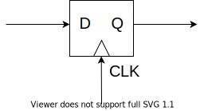
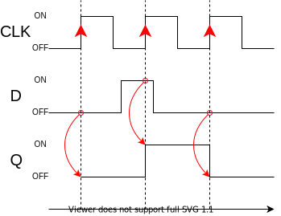
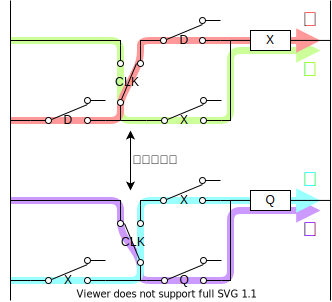
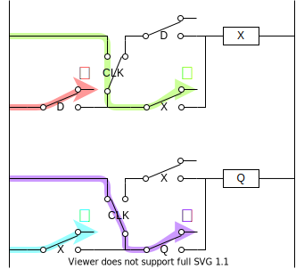

% D フリップフロップ
%
%

これは [リレーから始める CPU 自作 Advent Calendar 2021](https://adventar.org/calendars/7052) 5 日目の記事です。 [<<< 4 日目](../Day4_Latch/)

この記事では、論理回路の中でも一番の山場、D フリップフロップ回路（DFF）を解説します。

## DFF の仕事

DFF は信号を記憶する素子です。

CLK が立ち上がったタイミングの D の状態が記憶されて、Q に出力されます。

## 回路図と動作

複雑な回路ですが、ひとつずつ追っていけばわかる、はずです…！

### D=1

1. D が ON になると、 X が ON になる。
2. CLK が立ち上がると、① の経路は切れるが、② の経路は導通しているので、 X は ON を維持する。このとき、CLK が立ち上がってる間に、D が OFF になったとしても、X は ON を維持する。
3. X と CLK が ON なので、Q が ON になる。
4. CLK が立ち下がると、③ の経路は切れるが、④ の経路は導通しているので、Q は ON を維持する。

### D=0

1. D が OFF になると、X が OFF になる。
2. CLK が立ち上がると、Q が ON であったとしても、Q が OFF になる。このとき、CLK が立ち上がってる間に、D が ON になったとしても、X は OFF を維持する。
3. X と CLK が ON なので、Q が OFF になる。
4. CLK が立ち下がっても、Q は OFF を維持する。

[>>> 6 日目](../Day6_Counter/)
