% カウンタ回路を作ってみる
%
%

これは [リレーから始める CPU 自作 Advent Calendar 2021](https://adventar.org/calendars/7052) 6 日目の記事です。

## 分周器

DFF を使った回路で一番シンプルなのが分周器です。

Q と D が反転するようになっています。

クロック信号の周波数を半分にします。

## カウンタ

この分周器を複数繋げて、クロックを半分、半分、にしていくと、

