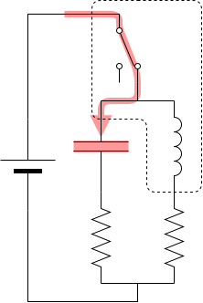
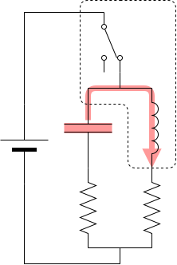

% クロック回路
%
% 2021-12-07

これは [リレーから始める CPU 自作 Advent Calendar 2021](https://adventar.org/calendars/7052) 7 日目の記事です。[<<< 6 日目](../Day6_Counter/)

車のウィンカーと同じ回路です。

リレーが OFF のとき、コンデンサに充電されます。

コンデンサに充電されて、電圧が上がり、リレーが ON になると、スイッチが切れます。

コンデンサに貯まった電気でリレーを ON にし続けます。

コンデンサの電気が切れると、リレーが OFF になり、またコンデンサに充電されます。

[>>> 8 日目](../Day8_Illumination/)
