% SoftEther VPN + Conoha VPS で共用ルーターを突破する
%
%

共用ルーターは外部からのトラフィックを通さない設定になっているので，自宅からサーバーを公開できません．

## 1. Conoha VPS の登録

[Conoha](https://www.conoha.jp/)

まず会員登録と支払い方法の設定を行う．

## 2. VPS サーバーの設定

支払いの確認が済んだらサーバーを追加する

CentOS を選択し追加

サーバーの ip アドレスを確認

TeraTerm で接続

Backspace が効かない → `export TERM=vt100`

### firewalld の設定

### SSH の

## 3. SoftEther VPN サーバーを設定

あとは公式のドキュメント（[7.3 Linux へのインストールと初期設定](https://ja.softether.org/4-docs/1-manual/7/7.3)）に従って設定していく

サーバーのソートをダウンロードして

WinSCP で転送

解凍

make がないようなのでインストール

make

/usr/local 以下に移動

パーミッションを変更

チェックをかける

スタートアップスクリプトに追加

サービス開始

bad interpreter: No such file or directory

改行コードが LF でなかった…

vpncmd
1
IP アドレス入力
エンター
VPN Server>
ServerPasswordSet を実行してパスワードを設定

管理者のパスワードを設定

無事 VPN サーバーが立ちました

[参考](https://www.linuxmania.jp/softether-vpn.html)

## 3. VPN に接続

クライアントとして使いたい PC に，「SoftEther VPN Client」をインストール．（[SoftEther VPN](https://ja.softether.org/5-download)）

仮想 LAN カードの作成

新しい接続

## 3. SoftEther Bridge をインストール

