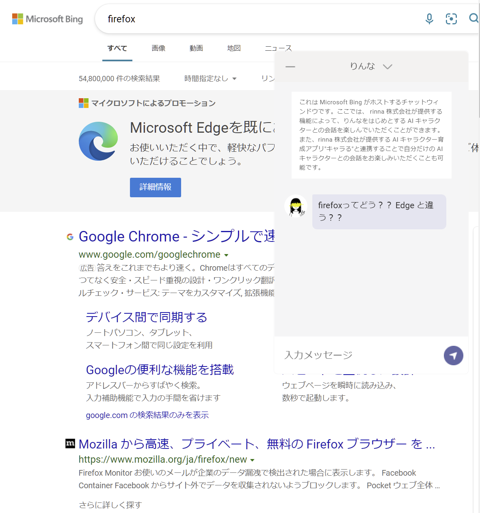

% Windows 11 に移行した
%
% 2021/10/28


## Windows 11 !!!

- WSL の GUI ! xeyes !
- Windows Terminal がデフォで入ってるやんいいね

## OS のインストール

1. マシンを用意します

|             |                              |
| ----------- | ---------------------------- |
| CPU         | Intel Core i5 10th gen 10400 |
| Memory      | 16G                          |
| MotherBoard | MSI                          |
| SSD         |                              |

2. 別の Windows マシンで Microsoft のツールを使ってインストール用の USB を作成します

3. BIOS を開いて TPM を有効化します．セキュリティのところにあるよ

4. 起動ディスクの優先順位を変更．DVD のアイコンを先頭に持ってくる

5. USB を挿して電源 ON ! ... ようこそ

## 禊

1. 転がってるパソコンからプロダクトキーを剥ぎ取って入力 ...

2. 変な機能は全部 OFF

3. じゃけんデフォルトアプリを消しましょうね～

```
Get-AppxPackage [アプリ名] | Remove-AppxPackage
```

「はじめに」がどれかわからん……

## アプリインストール

これすき（）



- Microsoft Store から
  - VSCode
  - Discord
  - Slack
  - Line
  - Ubuntu 20.04
- Chrome
- Firefox
- WSL
  - ｷﾀｷﾀｷﾀｷﾀ
  - `wsl --install`
- Steam

## 開発環境の構築
