2 本足の抵抗やコンデンサに比べて、3 本足のトランジスタの使い方は途端に難しく感じられます。

こういう、トランジスタが複雑に絡み合った回路を見ると、全くお手上げになってしまうかも。

しかし、このような複雑な回路も、基本的な 3 種類のトランジスタ回路の組み合わせにすぎません。

## トランジスタの使い方

トランジスタは小さな電流・電圧で大きな電流・電圧を制御する素子です。電気的なバルブ、蛇口だと思ってください。

トランジスタには、アナログ的な使い方と、デジタル的な使い方があります。蛇口も同じです。蛇口を弱く回せば水流を調整することができますし、全開にすれば水のスイッチとして使えます。

トランジスタも、入力に比例して出力するようにしたり、ON/OFF のスイッチとして使うこともできます。

アナログ的な使い方は、たとえば、ラジオの微弱な信号を増幅してスピーカーで聞こえるようにしたり、センサの電流を増強して処理回路に渡したりします。

デジタル的な使い方は、たとえば、モーターの ON/OFF を制御したり、論理回路のゲートとして使うことです。

## いろいろなトランジスタ

よく使われるトランジスタには大きく３種類あります。

|                    | バイポーラ トランジスタ BJT | 電界効果 トランジスタ MOS-FET | 絶縁ゲート バイポーラ トランジスタ IGBT |
| ------------------ | ----------------------------------- | ------------------------------------- | --------------------------------------------------- |
| 入力               | 電流                                | 電圧                                  | 電圧                                                |
| 入力インピーダンス | 低い                                | 高い                                  | 高い                                                |
| スイッチング速度   | 遅い                                | 速い                                  | 中間                                                |

このような特徴から、アナログ回路には BJT、デジタル回路には FET、パワー回路には IGBT が使われることが多いです。

よく誤解されがちですが、BJT をデジタル的に、FET をアナログ的に使うこともできます。

## バイポーラトランジスタ

トランジスタには、ベース・コレクタ・エミッタの 3 本のピンが生えています。

トランジスタは電流の蛇口です。コレクタ・エミッタ間電流を流す量を、ベースに流れる電流で制御します。

ベース・エミッタ間の電流 $I_{BE}$ の $h_{FE}$ 倍の電流を コレクタに流す。

$$
I_C = h_{FE} I_B
$$

また、トランジスタは電流を吸い込んだり、吐き出したりするわけではないので、キルヒホッフの法則から、

$$
I_E = I_B + I_C
$$

増幅率 $h_{FE}$ が十分大きいと仮定すると、

$$
I_E = I_B + I_C \approx I_C \quad (I_B \ll I_C)
$$

### エミッタ接地

最も基本的な回路です。

$$
I_B = \f{V_{IN}-V_{BE}}{R_B}
$$

$$
I_C = h_{FE} I_B
$$

$$
V_{OUT} = V_{CC} - R_C I_C
$$

### コレクタ接地

$$
V_{OUT} = V_{IN} - V_{BE}
$$

$$
I_E = \f{V_{IN}-V_{BE}}{R_E}
$$

$$
I_B = \f{1}{1 + h_{FE}} I_E
$$

$R_E$ 定電圧電源として使えます

### ベース接地

エミッタ接地に似た回路です。入力は負電圧です。

$$
I_E = \f{V_{IN} - V_{BE}}{R_E}
$$

$$
I_E = I_B + I_C \approx I_C \quad (I_B \ll I_C)
$$

$$
V_{OUT} = V_{CC} - I_C R_C
$$

### 厳密な話

実際には変動があります。

厳密には、データシートのグラフを全て満たしているかを確認する必要があります。

## 電界効果トランジスタ
