## 部品表

|                                                                         | 値段 | 備考                                                                            |
| ----------------------------------------------------------------------- | ---- | ------------------------------------------------------------------------------- |
| パワー系                                                                |      |                                                                                 |
| [ホットプレート](https://amzn.asia/d/dPVi2IT)                           | 1500 | 750W                                                                            |
| [ソリッドステートリレー](https://akizukidenshi.com/catalog/g/gK-00203/) | 250  | 25A                                                                             |
| [ヒートシンク](https://akizukidenshi.com/catalog/g/gP-05050/)           | 60   |                                                                                 |
| [絶縁放熱シート](https://akizukidenshi.com/catalog/g/gP-12791/)         | 20   |                                                                                 |
| [M3 プラネジ](https://akizukidenshi.com/catalog/g/gP-03583/)            |      |                                                                                 |
| 制御系                                                                  |      |                                                                                 |
| [Arduino](https://akizukidenshi.com/catalog/g/gK-10347/)                | 950  |                                                                                 |
| [5V 電源](https://akizukidenshi.com/catalog/g/gM-06096/)                | 600  |                                                                                 |
| [DC ジャック](https://akizukidenshi.com/catalog/g/gC-09408/)            |      |                                                                                 |
| [サーミスタ](https://akizukidenshi.com/catalog/g/gP-11896/)             | 50   | [データシート](https://www.semitec.co.jp/uploads/2021/11/nt_thermistor2015.pdf) |
| 空冷系                                                                  |      |                                                                                 |
| [MOSFET](https://akizukidenshi.com/catalog/g/gI-15751/)                 | 50   | お好きな MOSFET をどうぞ                                                        |
| [ファン](https://akizukidenshi.com/catalog/g/gP-16828/)                 | 280  |                                                                                 |
| ほか                                                                    |      |                                                                                 |
| [ターミナル](https://akizukidenshi.com/catalog/g/gP-01306/)             | 20   | 3 個                                                                            |
| 抵抗                                                                    |      |                                                                                 |
|                                                                         |      |                                                                                 |
|                                                                         |      |                                                                                 |

[一括注文リンク＠秋月](https://akizukidenshi.com/catalog/cart/cart.aspx?goods=K-00203,P-05050,P-12791,P-03583,K-10347,M-06096,C-09408,P-11896,I-15751,P-16828,P-01306,&qty=1,1,1,1,1,1,1,1,1,1,3,)

K-00203 1
P-05050 1
P-12791 1
P-03583 1
K-10347 1
M-06096 1
C-09408 1
P-11896 1
I-15751 1
P-16828 1
P-01306 3

## メモ

制御プログラムは、Web Serial API を使ってブラウザで実装する。

SVG on React で温度グラフをリアルタイムで描画。

### 温度制御

- 温度プロファイル
  1. △ 2 ~ 3 °C/sec
  2. 150 ~ 175 °C / 60 ~ 120 sec
  3. △ 4 °C/sec
  4. 250 °C / 60 ~ 90 sec
  5. ファンで急冷
- サーミスタの特性
  - exp(exp())っぽい特性
  - 160 度で 134Ω
  - 260 度で 23Ω
  - 47Ω ぐらいの抵抗を使うとよさそう？
  - ダイナミックレンジを広げたいなら、トランジスタの exp 特性を使うのがよさそう

### プログラム

1. GUI でプロファイル指定
2. RUN
3. 温度モニタリング
