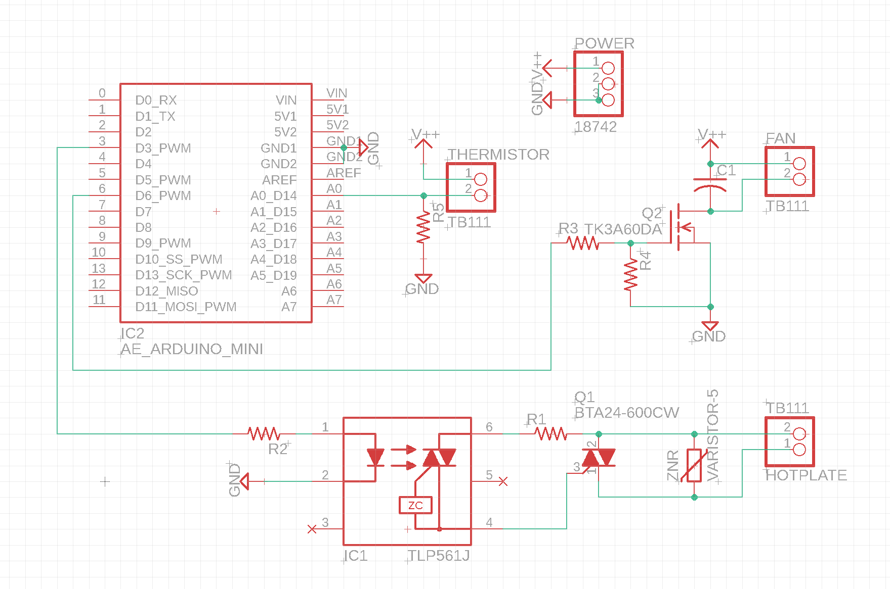

## 設計

- サーミスタで温度を計測しフィードバック制御する

- 温度プロファイルの設定 UI は、React で実装する
- Web Serial API を使ってブラウザと Arduino でシリアル通信する
- リアルタイムで温度のグラフを表示する

## 回路

|            |                                                                                 | 値段      | 備考                     |
| ---------- | ------------------------------------------------------------------------------- | --------- | ------------------------ |
| HOTPLATE   | [ホットプレート](https://amzn.asia/d/dPVi2IT)                                   | 1518      | 750W                     |
|            | [SSR キット](https://akizukidenshi.com/catalog/g/gK-00203/)                     | 250       |                          |
| IC1        | [フォトトライアック](https://akizukidenshi.com/catalog/g/gI-07634/)             | -         | SSR キット               |
| IC2        | [秋月 Arduino](https://akizukidenshi.com/catalog/g/gK-10347/)                   | 950       |                          |
| Q1         | [トライアック](https://akizukidenshi.com/catalog/g/gI-01017/)                   | -         | SSR キット               |
| Q2         | [MOSFET](https://akizukidenshi.com/catalog/g/gI-15751/)                         | 50        | お好きな MOSFET をどうぞ |
| R1         | 100Ω                                                                            | -         | SSR キット               |
| R2         | 330Ω                                                                            | -         | SSR キット               |
| R3         | [100Ω](https://akizukidenshi.com/catalog/g/gR-25101/)                           | 100/100=1 | MOSFET ゲート抵抗        |
| R4         | [10kΩ](https://akizukidenshi.com/catalog/g/gR-25103/)                           | 100/100=1 | MOSFET ゲート-ソース抵抗 |
| R5         | [75Ω 金属皮膜](https://akizukidenshi.com/catalog/g/gR-16620/)                   | 300/100=3 | サーミスタ分圧           |
| C1         | [0.1μF セラコン](https://akizukidenshi.com/catalog/g/gP-10149/)                 | 20        | モーターノイズ用         |
| ZNR        | [バリスタ](https://akizukidenshi.com/catalog/g/gP-12563/)                       | -         | SSR キット               |
|            | [ターミナル](https://akizukidenshi.com/catalog/g/gP-01306/)                     | 20\*3=60  |                          |
| FAN        | [DC ファン](https://akizukidenshi.com/catalog/g/gP-16828/)                      | 280       | DC 5V 0.3A               |
| THERMISTOR | [NT サーミスタ](https://akizukidenshi.com/catalog/g/gP-11896/)                  | 50        |                          |
| POWER      | [5V 電源](https://akizukidenshi.com/catalog/g/gM-06096/)                        | 600       |                          |
| POWER      | [DC ジャック](https://akizukidenshi.com/catalog/g/gC-09408/)                    | 30        |                          |
|            | [ヒートシンク（トライアック用）](https://akizukidenshi.com/catalog/g/gP-05050/) | 60        |                          |
|            | [ヒートシンク（FET 用）](https://akizukidenshi.com/catalog/g/gP-05052/)         | 35        | 不要かも                 |
|            | [絶縁放熱シート](https://akizukidenshi.com/catalog/g/gP-12791/)                 | 20\*2=40  |                          |
|            | [M3 プラネジ](https://akizukidenshi.com/catalog/g/gP-03583/)                    | 400/100=4 |                          |
| 合計       |                                                                                 | 3952      |                          |

[一括注文リンク＠秋月](https://akizukidenshi.com/catalog/cart/cart.aspx?goods=K-00203,K-10347,I-15751,R-25101,R-25103,R-16620,P-10149,P-01306,P-16828,P-11896,M-06096,C-09408,P-05050,P-05052,P-12791,P-03583&qty=1,1,1,1,1,1,1,3,1,1,1,1,1,1,2,1)

K-00203 1
K-10347 1
I-15751 1
R-25101 1
R-25103 1
R-16620 1
P-10149 1
P-01306 3
P-16828 1
P-11896 1
M-06096 1
C-09408 1
P-05050 1
P-05052 1
P-12791 2
P-03583 1

## 制御

### 温度制御

- トライアックがゼロクロス
  - → 最大でも 50/60Hz の制御
  - とりあえず PI 制御でいいかな
  - 分岐予測器みたいなオートマトンを使った ON/OFF 制御でもよさそう
    - 離散化した PI 制御と等価になりそう

### 温度計測

- サーミスタの特性
  - [データシート](https://www.semitec.co.jp/uploads/2021/11/nt_thermistor2015.pdf)

$$
R(T) = R_0 \exp \l[ B \l( \f{1}{T} - \f{1}{T_0} \r) \r]
$$

$$
V(T) = V_0 \f{R_P}{R(T)+R_P}
$$

- 基準温度：$T_0=298 \rm{K} (25°C)$
- 基準抵抗：$R_0=10000 \Omega$
- B 定数：$B=4126 \rm{K}$
- 分圧抵抗：$R_P=47 \Omega$
- 全電圧：$V_0=5\rm{V}$

### 温度逆算

$$
R(T) = R_P \l(\f{V_0}{V(T)}-1\r)
$$

$$
\f{1}{T} = \f{1}{B} \ln\l(\f{R(T)}{R_0}\r) + \f{1}{T_0}
$$

$$
T = \l\{\f{1}{B} \ln\l[\f{R_P}{R_0}\l(\f{V_0}{V(T)}-1\r)\r] + \f{1}{T_0}\r\}^{-1}
$$

1. ADC の値$V_A$から

$$
X = \f{47}{10000}\f{1024-V_{A}}{V_{A}}
$$

2. 対数を取る

$$
Y = \ln X
$$

対数関数は X のまわりで近似したものを使う

3. 温度を得る

$$
T = \f{1}{\f{Y}{B} + \f{1}{T_0}}
$$

### 温度プロファイル

1. △ 2 ~ 3 °C/sec
2. 150 ~ 175 °C / 60 ~ 120 sec
3. △ 4 °C/sec
4. 250 °C / 60 ~ 90 sec
5. ファンで急冷

### 温度プロファイルのフォーマット

|     |     |                                                          |
| --- | --- | -------------------------------------------------------- |
| 0   | 7~4 | ステップ番号(0~15)                                       |
| 0   | 3~0 | 内容(0:SLOPE,1:CONST,2:FAN,3:END)                        |
| 1   | 7~0 | 温度(SLOPE,FAN なら到達目標温度、CONST なら維持する温度) |
| 2   | 7~0 | 時間(sec)                                                |

#### 例

|           |          |                              |
| --------- | -------- | ---------------------------- |
| 0000-0000 | #0 SLOPE | 60 秒で 150°C まで上げる     |
| 0d 150    | 150 °C   |                              |
| 0d 60     | 60 sec   |                              |
| 0001-0001 | #1 CONST | 90 秒間 150°C を維持         |
| 0d 150    | 150 °C   |                              |
| 0d 90     | 90 sec   |                              |
| 0010-0000 | #2 SLOPE | 60 秒で 250°C まで上げる     |
| 0d 250    | 250 °C   |                              |
| 0d 30     | 30 sec   |                              |
| 0011-0001 | #3 CONST | 60 秒間 250°C を維持         |
| 0d 250    | 250 °C   |                              |
| 0d 60     | 60 sec   |                              |
| 0100-0010 | #4 FAN   | 30 °C になるまでファンで冷却 |
| 0d 30     | 30 °C    |                              |
| 0         | - sec    |                              |
| 0101-0011 | #5 END   | おわり                       |
| 0         |          |                              |
| 0         |          |                              |

### UX

1. GUI でプロファイル指定
2. RUN ボタン押す
3. 温度制御開始
4. 温度モニタリング

### 通信方式

#### 実行命令

- 温度プロファイルを送信することでリフローを開始する
- フォーマットは、

#### 停止命令
