## 部品

- [ホットプレート](https://amzn.asia/d/dPVi2IT)
  - 1500 円
  - 750W
- [ソリッドステートリレー](https://akizukidenshi.com/catalog/g/gK-00203/)
  - 250 円
  - 25A
- [ヒートシンク](https://akizukidenshi.com/catalog/g/gP-05050/)
  - 60 円
- [絶縁放熱シート](https://akizukidenshi.com/catalog/g/gP-12791/)
  - 20円
- [6V トランス](https://akizukidenshi.com/catalog/g/gP-08731/)
  - 1050 円
  - センタータップ付き
- ダイオード [30V1A 11EQS03L](https://akizukidenshi.com/catalog/g/gI-11362/)
  - 低Vf
- レギュレータ [7805](https://akizukidenshi.com/catalog/g/gI-08678/)
- サーミスタ [１０３ＮＴ－４－Ｒ０２５Ｈ４１Ｇ](https://akizukidenshi.com/catalog/g/gP-11896/)
  - [データシート](https://www.semitec.co.jp/uploads/2021/11/nt_thermistor2015.pdf)
  - 50 円
- [Arduino](https://akizukidenshi.com/catalog/g/gK-10347/)
  - 950 円
- [ファン](https://akizukidenshi.com/catalog/g/gP-16828/)
  - 5V 0.3A
  - 280 円
- ファン制御用 MOSFET
  - 余ってたMOSFET
  - [TK3A60DA](https://akizukidenshi.com/catalog/g/gI-15751/)
  - 50 円

## メモ

AC アダプタ買った方が安くないか？？？？？？←

制御プログラムは、Web Serial API を使ってブラウザで実装する。

SVG on React でグラフをリアルタイムで描画。

### 温度制御

- 温度プロファイル
  1. △ 2 ~ 3 °C/sec
  2. 150 ~ 175 °C / 60 ~ 120 sec
  3. △ 4 °C/sec
  4. 250 °C / 60 ~ 90 sec
  5. ファンで急冷
- サーミスタの特性
  - exp(exp())っぽい特性
  - 160度で134Ω
  - 260度で23Ω
  - 47Ωぐらいの抵抗を使うとよさそう？
  - ダイナミックレンジを広げたいなら、トランジスタのexp特性を使うのがよさそう

### プログラム

1. GUIでプロファイル指定
2. RUN
3. 温度モニタリング

