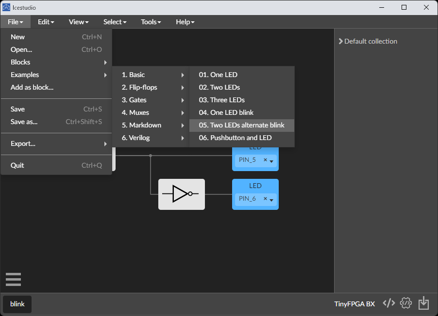
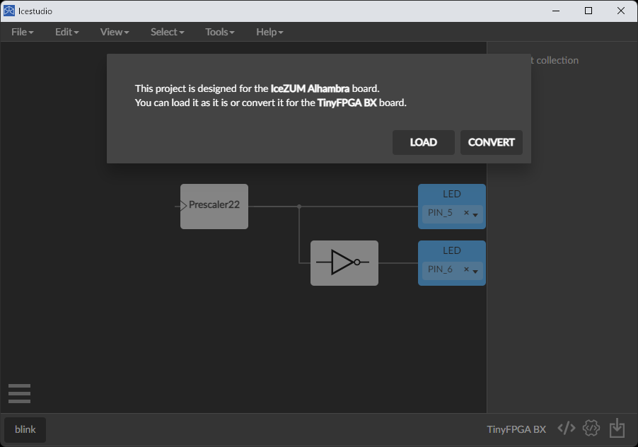
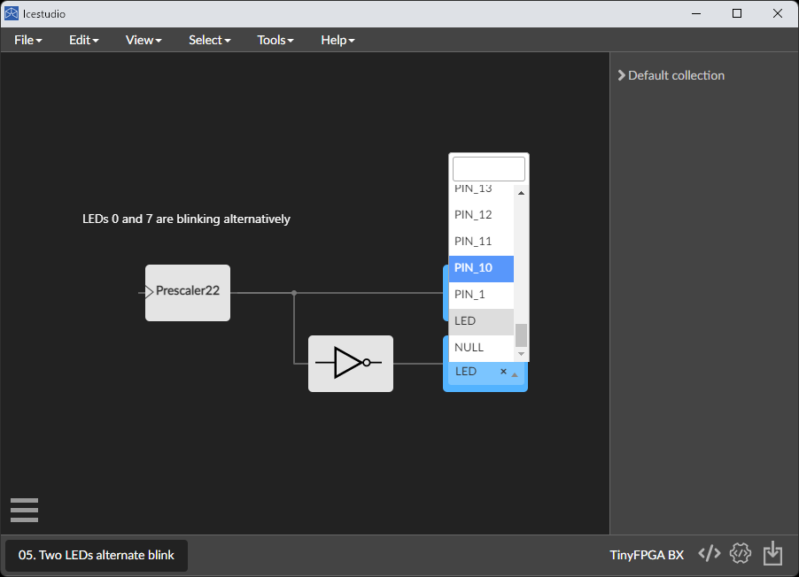
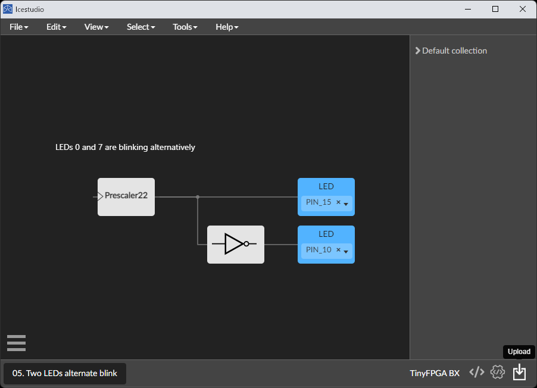

TinyFPGA BX は Lattice 社製の FPGA、iCE40LP8K を搭載した開発ボードです。iCE40 は一連の開発ツールが完全にオープンソース化されている数少ない FPGA です。

## 情報リンク

- iCE 40
  - [iCE 40 Family Handbook](https://www.latticesemi.com/~/media/LatticeSemi/Documents/Handbooks/iCE40FamilyHandbook.pdf)
  - [iCE 40 DataSheet](https://www.latticesemi.com/~/media/LatticeSemi/Documents/DataSheets/iCE/iCE40LPHXFamilyDataSheet.pdf)
  - [iCE 40 Programming and Configuration](https://www.latticesemi.com/view_document?document_id=46502)
  - [iCE40 ユーザーガイド](https://www.macnica.co.jp/business/semiconductor/articles/iCE40_UserGuide_rev1.7__2.pdf)
- IceStudio
  - [リポジトリ](https://github.com/FPGAwars/icestudio)
  - [インストールマニュアル](https://github.com/FPGAwars/icestudio/wiki/Installation)
- TinyFPGA BX
  - [ウェブサイト](https://tinyfpga.com/)
  - [TinyFPGA BX ユーザーガイド](https://tinyfpga.com/b-series-guide.html)
  - [リポジトリ](https://github.com/tinyfpga/TinyFPGA-BX)
  - [TinyFPGA BX 回路図](https://github.com/tinyfpga/TinyFPGA-BX/blob/master/board/TinyFPGA-BX-Schematic.pdf)
  - [TinyFPGA ブートローダ](https://github.com/tinyfpga/TinyFPGA-Bootloader)
  - 通販
    - [CrowdSupply](https://www.crowdsupply.com/tinyfpga/tinyfpga-ax-bx)
    - [Sparkfun](https://www.sparkfun.com/products/14829)
    - [Mouser](https://www.mouser.jp/new/crowd-supply/crowd-supply-tinyfpga-bx-board/)
    - [千石電商](https://www.sengoku.co.jp/mod/sgk_cart/detail.php?code=EEHD-5C6J)
    - ※ どこも在庫切れ（2022/06/26 確認）みたいです orz………おらの村には半導体がねぇ
- ほか
  - [RISC-V on FPGA (the tinyFPGA) via WSL - Part 2](https://gojimmypi.blogspot.com/2019/01/risc-v-on-fpga-tinyfpga-via-wsl.html)
  - [AT25SF041B SPI Flash データシート](https://www.mouser.jp/datasheet/2/590/at25sf041b-1888127.pdf)

## ブートローダのアップデート

Python と pip が必要なのでインストールしておきましょう。

TinyFPGA に必要なツールをインストールします。依存するモジュールをインストールしろと言われたらインストールします。

```
pip install tinyprog
```

TinyFPGA ボードを PC に接続して、ドライバが認識されたのを確認します。

Windows 10 以前のバージョンを使っている場合、[Virtual Serial Port](https://www.pjrc.com/teensy/usb_serial.html) が必要なようです。

TinyFPGA のブートローダのアップデートをします。

```
tinyprog --update-bootloader
```

※ TinyFPGA BX にはプログラマ基板が不要です。その代わり、FPGA の一部にプログラマ回路が書き込まれています。間違えて上書きしてしまった場合、Arduino を使ってブートローダを復元することができます。[Programming with an Arduino](https://github.com/tinyfpga/TinyFPGA-B-Series/tree/master/programmer_arduino)

## 開発環境

- Lattice の iCEcube2 ← ユーザーガイドに書かれてる方法
- APIO (Atom プラグイン)
  - [APIO ドキュメント](https://apiodoc.readthedocs.io/en/stable/source/installation.html)
- Icestorm
  - [tinyFPGA-BX board に Terminal のみで build とボードへの書き込みを行った](https://qiita.com/KYhei/items/0b8fb029bb8813c8cbd6)
- Icestudio ← 今回はこれ

[Icestudio](https://icestudio.io/#lk-download)をインストールします。インストーラに従うだけなので省略。

Icestudio を開いて、

ボードの選択画面が出てきたら、TinyFPGA BX を選択。

右下のポップアップに従って必要なツールをインストール。

## L チカ

サンプルコードから、L チカを選択。



Convert を選択。



LED を接続するピンを選択。



TinyFPGA ボードを接続して、右下の Upload をクリック。



L チカしました。

<iframe width="560" height="315" src="https://www.youtube.com/embed/hzZ5VPpSlpU" title="YouTube video player" frameborder="0" allow="accelerometer; autoplay; clipboard-write; encrypted-media; gyroscope; picture-in-picture" allowfullscreen></iframe>

※ うまくいかない場合、**USB アダプタに接続して電源のみを供給** すると、L チカするはずです。PC に接続すると、ブートローダは通信待機状態で起動してしまい、ユーザーイメージを読み込みません。

## 資料
