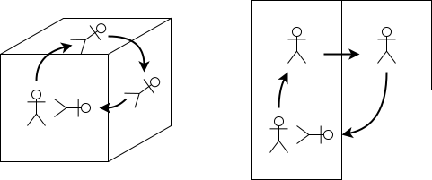

% 微分幾何
%
%

微分幾何ゼミ資料

## 地球を地面から俯瞰する

我々の住む世界がどんな形をしているのか，古代の人々はあれこれ考えたようだ．あるインド人は亀に支えられた円盤だといい，あるバビロン人は巨大なドームだといったが，定量的な主張をしたのはエラトステネスであった．彼は，緯度の異なる２点における太陽高度と，その２点間の距離を測り，地球の径を求めた．幾何を用いて世界を探ろうとする初期の試みである．

世界の形を表した図が地図である．

微分幾何学は地図学の延長にある．空間を理解するための道具の蓄積が微分幾何学である．このことを心掛けておくと，たとえば多様体が地球儀に見えてくる．勝手知ったる概念であったりする．

世界を探求する営みのそばには常に「微分幾何」があった．ガガーリンを待たずとも，人類は地球を俯瞰していた．

※１　ニュートンが微積分を用いて力学の体系を確立したことは有名だが，プリンキピアの記述は現代のニュートン力学とは全く毛色の違うものであったことはあまり有名でない．というのも，プリンキピアは数式でなく図形で書かれているのだ．（詳しく知りたい方には「ファインマンさん，力学を語る」をお勧めする．）そこで使われた幾何と微分幾何とは理論的な関連性は薄いとはいえ，微積分の黎明に幾何学が立ち会っていたことは奇遇であろうか．

## 物理における微分幾何

地球を記述するために発達してきた地図学は，空間を記述する微分幾何学へと進化した．この空間というのは

## 多様体

地球が丸いと教えられてはいるものの，日常生活で地球の丸さのせいで悩むことはあまりない．（飛行機は地球の丸さを考えないといらぬ遠回りをすることになってしまう．）地球の丸さを考えずに暮らせるのは，地球が多様体であるからである．

> 多様体とは局所的にユークリッド空間な空間のことをいう．

地球は局所的にユークリッド空間である．地球が球体であっても，暮らしている町程度の領域ではユークリッド空間として差支えない．

## 局所座標

道案内を考えてみよう．京都のような整然とした町割りであれば道案内は簡単だろう．一方で，赤門の向かいあたりの複雑で入り組んだ道順を伝えるのは難しい．確実に伝えるにはどうしたらいいだろうか．交差点ごとに様子がそれぞれで異なるために，交差点ごとに次の行き先を指定するのが難しい．碁盤の目であれば左右で指定できるのに．碁盤の目であればどの交差点も同じ交わり方をしているので方向は左・右・直進しかないが，交差点ごとに交わり方が様々であれば方向の指定がそれぞれの交差点ごとに変わってくる．

ユークリッド空間では，どの点をとっても，周囲の空間は同じに見える．一方，多様体では，それぞれの点ごとに周囲の様子が変わってくる．凹んでいるところもあれば鞍状になっているところもある．

## 接続

伊能忠敬が日本中を歩き回って作った地図を貼り合わせという逸話がある．真偽はともかく，理想的な地図を紙に描こうとすると必ず歪みが生じることは古くから知られていた．

なぜ歪むのか．

地球を歩き回るのは大変なので，角砂糖の上を歩く蟻を見てみよう．こいつはその場で回転ができず平行移動しかできないというみょうちくりんな蟻である．

**平行移動だけで回転してしまった** のである．ユークリッド空間に暮らす我々は，平行と回転は独立なものであると考えがちだが，

## 同相写像

鉄道路線図

## 参考文献

- 永長直人「微分幾何学とトポロジー」
