% 熱工学
%
%

$$
\newcommand{\D}[2][]{\frac{\mathrm{D} #1}{\mathrm{D} #2}}
\newcommand{\d}[2][]{\frac{\mathrm{d} #1}{\mathrm{d} #2}}
\newcommand{\dd}[2][]{\frac{\mathrm{d}^2 #1}{\mathrm{d} {#2}^2}}
\newcommand{\pd}[2][]{\frac{\partial #1}{\partial #2}}
\newcommand{\pdf}[3][]{\left( \frac{\partial #1}{\partial #2} \right)_{#3}}
\newcommand{\pdd}[2][]{\frac{\partial^2 #1}{\partial {#2}^2}}
\newcommand{\pddd}[2][]{\frac{\partial^3 #1}{\partial {#2}^3}}
$$

## 熱力学

### 系

|          |     |           |
| -------- | --- | --------- |
| 孤立系   | NVE | dQ=0,dN=0 |
| 閉じた系 | NVT | dN=0      |
| 開いた系 | μVT |           |

### 状態量

示量性：E,V,S
示強性：T,P

### 平衡状態

状態量は平衡状態においてのみ定義される

### 第二法則

エントロピー変化を系内の不可逆過程によって生じるエントロピーと系外との熱のやりとりに伴うエントロピー変化に分ける

$$
dS=d_iS+d_eS
$$

第二法則は

$$
d_iS\geq 0
$$

### 孤立系 $\delta Q=0$

$$dS=d_iS\geq 0$$

### 閉じた系

$$
\begin{aligned}
d_iS &\geq&0\\
d_eS &=& \frac{\delta Q}{T} \\
dS &\geq& \frac{\delta Q}{T}
\end{aligned}
$$

### 開いた系

$$
\begin{aligned}
\frac{dS}{dt}&=&\frac{d_iS}{dt}+\frac{d_eS}{dt}+\left(\dot{m}_{in}s-\dot{m}_{out}s\right)\\
\frac{d_eS}{dt}&=&\frac{\dot{Q}}{T}\\
\frac{d_iS}{dt}&=&\frac{dS}{dt}-\frac{\dot{Q}}{T}+\left(\dot{m}_{in}s-\dot{m}_{out}s\right)\\
&\geq&0
\end{aligned}
$$

## 物質量が変化する系

$$dU=TdS-PdV+\sum \mu dN$$
$$U=U(S,V,N,,,)$$

$$
\begin{alignedat}{5}
T&=&\pd[U]{S}\\
P&=-&\pd[U]{V}\\
\mu&=&\pd[U]{N}
\end{alignedat}
$$

物質量の変化を内部変化によるものと外部からの流入によるものに分ける
$$dN=d_iN+d_eN$$

$$
\begin{aligned}
dS&=&\frac{dU+PdV}{T}-\frac{1}{T}\sum\mu_i(d_iN_i+d_eN_i)\\
d_iS&=&-\frac{1}{T}\sum\mu_id_iN_i\\
d_eS&=&\frac{dU+PdV}{T}-\frac{1}{T}\sum\mu_id_eN_i
\end{aligned}
$$

## 熱力学の一般関係式

### デュエムの定理

閉じた系の安定平衡状態は２つの独立変数によって決定される．

### 相反・循環の関係式

全微分可能な関数$z(x,y)$について
$$\pdf[x]{z}{y}\pdf[z]{x}{y}=1$$
$$\pdf[x]{y}{z}\pdf[y]{z}{x}\pdf[z]{x}{y}=-1$$

### 極値原理・マクスウェルの関係式

|                     |        |     |                       |                      |                                  |
| ------------------- | ------ | --- | --------------------- | -------------------- | -------------------------------- |
| 孤立系              | S      | max |                       |                      |                                  |
| 閉じた系（VS 一定） | U      | min | $$\pdf[U]{S}{V} = T$$ | $$\pdf[U]{V}{S}=-p$$ | $$\pdf[T]{V}{S}=-\pdf[p]{S}{V}$$ |
| 閉じた系（pS 一定） | H=U-pV | min | $$\pdf[H]{S}{p} = T$$ | $$\pdf[H]{p}{S}= V$$ | $$\pdf[T]{p}{S}= \pdf[V]{S}{p}$$ |
| 閉じた系（VT 一定） | F=U-TS | min | $$\pdf[F]{V}{T} =-p$$ | $$\pdf[F]{T}{V}=-S$$ | $$\pdf[p]{T}{V}= \pdf[S]{V}{T}$$ |
| 閉じた系（pT 一定） | G=H-TS | min | $$\pdf[G]{p}{T} = V$$ | $$\pdf[G]{T}{p}=-S$$ | $$\pdf[V]{T}{p}=-\pdf[S]{p}{T}$$ |

### オイラー方程式

$$U=TS-pV+\sum \mu N$$

### ギブス・デュエムの式

$$SdT-Vdp+\sum Nd\mu=0$$

## 化学反応

$$\sum a_i A_i \rightarrow \sum b_i B_i$$
反応進行度
$$d\xi = \frac{dN_{Ai}}{-a_i}=\frac{dN_{Bi}}{b_i}$$
親和力(Affinity)
$$A=\sum \mu_{Ai}a_i - \sum \mu_{Bi}b_i$$
$$d_iS=\frac{A}{T}d\xi$$
第二法則より
$$\frac{d_iS}{dT}=\frac{A}{T}\frac{d\xi}{dT}\gt 0$$
Thermodynamic Force ($\frac{A}{T}$) の正負で反応の向きがわかる

## 相平衡

### $T,P,\mu$の制約（ギブス・デュエムの式）

$$U=U(S,V,N,,,)$$
$$SdT-VdP+\sum Nd\mu=0$$

### 平衡の条件（クラペイロンの式）

$$d\mu^{(1)}=d\mu^{(2)}$$
$$\frac{dP}{dT}=\frac{s^{(2)}-s^{(1)}}{v^{(2)}-v^{(1)}}=\frac{\Delta s}{\Delta v}=\frac{\Delta q}{T\Delta v}$$
圧力一定で
$$\frac{dP}{dT}=\frac{\Delta h}{T\Delta v}$$

### 気液平衡（クラウジウス・クラペイロンの式）

気体は体積が大きい$v^{(g)}>>v^{(l)}$かつ気体は理想気体$v^{(g)}=RT/P$とすると，
$$\frac{dP}{dT}=\frac{P\Delta h}{RT^2}$$
$$\ln P_2 - \ln P_1=\frac{\Delta h}{R}\left(\frac{1}{T_1}-\frac{1}{T_2}\right)$$
$\Delta h$が気化熱

### 平衡状態の自由度（相律，Phase Rule）

$$f=C-P+2$$

## 熱機関

### PV 線図・ST 線図

## ブレイストンサイクル

