% 物性物理
%
%

## 1. 結晶

基本単位胞：格子ベクトルが張る平行六面体

ミラー指数：周期的な格子中の方向や面を表す記法

## 2. Drude モデル

電子は金属中の原子核と衝突しながらランダムに運動しているという古典的なモデル。

### 2.1. 直流電場応答

電場がかかった金属中の電子が従う運動方程式は、緩和時間を $\tau$ として、

$$
m\d{v}{t} + \f{m}{\tau}v = -eE \tag{2.1.1}
$$

定常状態 ($\d{v}{t}=0$) に達したときの速度（ドリフト速度）は、

$$
v_d=-\f{e\tau}{m}E \tag{2.1.2}
$$

運動量は $p(t)=mv(t)$ だが、次の瞬間の運動量（の期待値）は、衝突する確率 $\f{dt}{\tau}$ 、外力 $f=-eE$ を用いて、

$$
p(t+dt) = \l(1-\f{dt}{\tau}\r)p(t) + fdt \tag{2.1.3}
$$

☆ 衝突するとランダムな方向に飛んでいくので、運動量の期待値は $0$ になる

$\d{p}{t}=(p(t+dt)-p(t))/dt$ を用いて式変形すると

$$
m\d{v}{t}=-\f{m}{\tau}v-eE \tag{2.1.4}
$$

オームの法則と対照して定数を比べる。

- 微視的な数
  - 電荷素量 $e$
  - 緩和時間 $\tau$
  - 電子密度 $n$
  - 電子のドリフト速度 $v_d$
- 巨視的な数
  - スケールに依存する量
    - 電流 $J$
    - 電位差 $V$
    - 抵抗 $R$
  - スケールに依存しない量
    - 電流密度 $j=J/S$
    - 電場 $E=V/L$
    - 電気抵抗率 $\rho=RS/L$
    - 電気伝導率 $\sigma=1/\rho$

オームの法則 $V=JR$ をスケールに依存しない量で書き直すと

$$
E=j\rho \tag{2.1.5}
$$

ドリフト速度の式

$$
v_d=-\f{e\tau}{m}E \tag{2.1.2}
$$

電流密度の式

$$
j=-nev_d \tag{2.1.6}
$$

以上の式から

$$
\sigma = 1/\rho = \f{ne^2\tau}{m} \tag{2.1.7}
$$

### 2.2. 交流電場応答

運動方程式は

$$
m\dd{v}{t} + \f{m}{\tau}\d{v}{t} = -eE(t) \tag{2.2.1}
$$

周波数 $\omega$ の交流電場 $E(t)=E_0\exp(-i\omega t)$ 速度 $v(t)=v_0\exp(-i\omega t)$ を代入すると、

$$
\l(-m\omega^2-i\f{m\omega}{\tau}\r)u_0\exp(-i\omega t) = -eE_0\exp(-i\omega t) \tag{2.2.2}
$$

$$
u_0=\f{eE_0}{m\omega (\omega + i/\tau)} \tag{2.2.3}
$$

☆ 電流の振幅は周波数の関数になっている

電束密度

$$
D=\eps E = \eps_0 \eps_r E= \eps_0 E + P \tag{2.2.4}
$$

分極率 $P=-neu$

$$
P = -\f{ne^2}{m}\f{1}{\omega(\omega + i/\tau)}E \tag{2.2.5}
$$

プラズマ周波数

$$
\omega_P = \sqrt{\f{ne^2}{m\eps_0}} \tag{2.2.6}
$$

以上より、

$$
\eps_r = 1-\f{\omega_P^2}{\omega(\omega + i/\tau)} \tag{2.2.7}
$$

## 3. ゾンマーフェルトモデル

### 3.1. シュレディンガー方程式

周期境界条件を課したシュレディンガー方程式

$$
E\psi(r)=\hat{H}\psi(r)
$$

$$
\hat{H}=\f{1}{2m}\hat{p}^2+V(r)=-\f{\hbar^2}{2m}\nabla^2 + V(r)
$$

$V(r)=0$ として解くと、

$$
\psi(r)=\f{1}{L^{3/2}}\exp(ih\cdot r)
$$

### 3.2. 逆格子空間

### 3.3. 状態密度

### 3.4. 電子比熱

## 4. 半導体
