% 流体力学
%
%

$$
\newcommand{\d}[2][]{\frac{\mathrm{d} #1}{\mathrm{d} #2}}
\newcommand{\dd}[2][]{\frac{\mathrm{d}^2 #1}{\mathrm{d} {#2}^2}}
\newcommand{\pd}[2][]{\frac{\partial #1}{\partial #2}}
\newcommand{\pdd}[2][]{\frac{\partial^2 #1}{\partial {#2}^2}}
$$

## 基礎方程式
### 流体の記述
- 速度 $u_i$
  - 変形速度 $d_{ij} := \pd{x_j} u_i$ → 歪み速度 $S_{ij}:=d_{(ij)}$ + 回転速度 $\Omega_{ij}:=d_{[ij]}$
  - 渦度 $\omega_k := \epsilon_{ijk}d_{ij}$
- 応力 $\sigma_{ij}$
- 密度 $\rho$
- 圧力 $p$
- 外力 $g_i$

### さまざまな条件
- 非圧縮
  - マッハ数が小さい
  - だいたいこれ
- 非粘性
  - 粘性項が消える
- 非回転
  - 速度場の回転がない場合

### 質量保存則（連続の式）
$$
\pd{t}\rho+\pd{x_i}(\rho u_i)=0
$$

#### 非圧縮
$$
\pd{x_i}u_i=0
$$

### 運動量保存則（運動方程式）

$$
\pd{t}(\rho u_i) + \pd{x_j}(\rho u_i u_j)=\pd{x_i}\sigma_{ii}+\rho g_i
$$

### 構成則

構成方程式の一般式

$$
\sigma_{ij}=\mathcal{F}(d_{kl})
$$

1. 静水圧

$$
\sigma_{ij} = -p\delta_{ij}
$$

2. 変形速度テンソル（対称・等方的）

$$
\sigma_{ij} = C_{ijkl}d_{kl}
$$

$$
C_{ijkl} = \lambda\delta_{ij}\delta_{kl} + \mu\delta_{ik}\delta_{jl} + \nu\lambda_{il}\lambda_{jk}
$$

ニュートン流体の構成方程式

$$
\sigma_{ij} = \left( -p + \frac{2}{3} \mu S_{kk} \right) \delta_{ij} + 2 \mu S_{ij}
$$

### ナビエストークス方程式

$$
\pd{t}(\rho u_i)+\pd{x_j}(\rho u_iu_j)=-\pd{x_i}\left(p+\frac{2}{3}\mu\partial_ku_k\right)+\mu\pd{x_j}\left(\pd{x_j}u_i+\pd{x_i}u_j\right)+\rho g_i
$$

#### 非圧縮非圧縮

$$
\rho \left( \pd{t} u_i + u_j \pd{x_j} u_i \right) = -\pd{x_i} p + \mu \pd{x_j} \pd{x_j} u_i + \rho g_i
$$

#### 無次元化 $D,V,L$ 

$$
\rho \pd{t} u_i + \rho u_j \pd{x_j} u_i = -\pd{x_i} p + \frac{\mu}{DVL} \pd{x_j} \pd{x_j} u_i + \rho g_i
$$

レイノルズ数 $Re:=\frac{\rho V L}{\mu}$ と外力場 $g_i$ が同じなら相似な流れになる．

微分方程式の解が同じになる．

### π定理

法則が $n$ 個の変数 $(q_1,q_2,,,q_n)$ で表現されていて，変数が $k$ 個の独立な基本単位で表されるとき，

|       | $e_1$ | ... | $e_k$ |
| :---: | ----- | --- | ----- |
| $q_1$ |       |     |       |
|   :   |       | $M$ |       |
| $q_n$ |       |     |       |

$k=\mathrm{rank}\,M$

無次元数の数 $=\mathrm{null}\,M$

### 二次元
$$
\begin{aligned}
\pd[u]{x} + \pd[v]{y} &= 0 \\
\rho \left( \pd[u]{t} + u \pd[u]{x} + v \pd[u]{y} \right) &= -\pd[p]{x} + \mu \left( \pdd[u]{x} + \pdd[u]{y} \right) + \rho g_x \\
\rho \left( \pd[v]{t} + u \pd[v]{x} + v \pd[v]{y} \right) &= -\pd[p]{y} + \mu \left( \pdd[v]{x} + \pdd[v]{y} \right) + \rho g_y 
\end{aligned}
$$

### 円筒座標 $(r,\theta,z)$
$$
\begin{aligned}
\frac{1}{r} \pd{r}(ru_r) + \frac{1}{r} \pd{\theta} u_\theta + \pd{z} u_z &= 0 \\
\rho \left( \pd[u_r]{t} + u_r \pd[u_r]{r} + \frac{u_\theta}{r} \pd[u_r]{\theta} - \frac{u_\theta^2}{r} + u_z \pd[u_r]{z} \right) &= -\pd[p]{r} + \mu \left[ \pd{r} \left(\frac{1}{r}\pd{r}(ru_r)\right) + \frac{1}{r^2}\pdd[u_r]{\theta} - \frac{2}{r^2} \pd[u_\theta]{\theta} + \pdd[u_r]{z} \right] + \rho g_r \\
\rho\left( \pd[u_\theta]{t} + u_r \pd[u_\theta]{r} + \frac{u_\theta}{r} \pd[u_\theta]{\theta} + \frac{u_ru_\theta}{r} + u_z \pd[u_\theta]{z} \right) &= -\frac{1}{r}\pd[p]{\theta} + \mu \left[ \pd{r} \left( \frac{1}{r} \pd{r}(ru_\theta)\right) + \frac{1}{r^2} \pdd[u_\theta]{\theta} + \frac{2}{r^2} \pd[u_r]{\theta} + \pdd[u_\theta]{z} \right] + \rho g_\theta \\
\rho\left( \pd[u_z]{t} + u_r \pd[u_z]{r} + \frac{u_\theta}{r} \pd[u_z]{\theta} + u_z\pd[u_z]{z} \right) &= -\pd[p]{z} + \mu \left[ \frac{1}{r} \pd{r} \left(r\pd{r}u_z\right) + \frac{1}{r^2} \pdd[u_z]{\theta} + \pdd[u_z]{z} \right] + \rho g_z
\end{aligned}
$$

## 渦度・流れ関数

二次元非圧縮流非粘性流れ（完全流体）のNS方程式の互換表現

### 渦度

$$
\zeta = \mathrm{rot} u
$$

### 流れ関数

$$
u = \pd[\psi]{y} \quad v = -\pd[\psi]{x} 
$$

### 渦度（輸送）方程式

$$
\nabla^2 \psi = - \zeta
$$

$$
\pd[\zeta]{t} + \pd[\psi]{y} \pd[\zeta]{x} - \pd[\psi]{x} \pd[\zeta]{y} = \nu \nabla^2 \zeta
$$

## 円管内層流（ポアズイユ流れ）

半径 $R$ の円管

軸対称 $\partial_\theta=0, u_\theta=0$, 発達流 $\partial_z=0$, 定常 $\pd{t}=0$, 円管表面で $u=0$

NS方程式に条件を適用して，

$$
\d[p]{z} = \mu\frac{1}{r} \d{r} \left( r \d[u_z]{r} \right)
$$

これを解く

$$
\begin{aligned}
\d{r} \left( r \d[u_z]{r} \right) &= \frac{1}{\mu} \d[p]{z} r \\
r \d[u_z]{r} &= \frac{1}{2\mu} \d[p]{z} r^2 + C_1 \\
\d[u_z]{r} &= \frac{1}{2\mu} \d[p]{z} r + C_1 r^{-1} \\
u_z &= \frac{1}{4\mu} \d[p]{z} r^2 + C_1 \ln r + C_2 \\
\end{aligned}
$$

$u_x(r)$ は有限なので $C_1=0$ ，また円管表面で $u_z(R)=0$ より

$$
u_z(r) = \frac{1}{4\mu} \left(-\d[p]{z}\right) (R^2-r^2)
$$

中心流速は

$$
u_0 = u(0) = \frac{1}{4\mu} \left(-\d[p]{z}\right) R^2
$$

流量は

$$
Q = \int_0^R 2 \pi r u(r) dr = \frac{\pi}{8\mu} \left(-\d[p]{z}\right) R^4
$$

平均流速は

$$
U = \frac{Q}{\pi R^2} = \frac{u_0}{2}
$$

表面の摩擦応力は

$$
\tau = \frac{1}{2} \left(-\d[p]{z}\right) R
$$

円管の圧力損失は

$$
\Delta p = \left(-\d[p]{z}\right) L = \frac{8 \mu L}{R^2} U
$$

### 血管の分岐（Murrayの法則）

評価関数を

$$
J = Q \Delta P + K \frac{\pi d^2}{4} L
$$

### 熱伝達

## 平行平板

間隔 $H$, すべり速度 $U$

発達流，定常

$$
0 = - \d[p]{x} + \mu \dd[u]{y}
$$

一般解は

$$
u(y) = - \frac{1}{2\mu} \left(-\d[p]{x}\right) y^2 + C_1 y + C_2
$$

底板は固定 $u(0)=0$， 上板は速度 $U$ ですべっているので $u(H)=U$

$$
u(y) = - \frac{1}{2\mu} \left(-\d[p]{x}\right) y(y-H) + \frac{U}{H} y
$$

### 穴あき平板

底板平板から一定の湧き出し $V_0$ ，上板から同じ吸い込みがあるとき，

$$
\rho V_0 \d[u]{y} = - \d[p]{x} + \mu \dd[u]{y}
$$

$\alpha:=-\frac{\rho V_0}{\mu}, \beta:=-\frac{1}{\mu}\d[p]{x}$ とすると，

$$
\dd[u]{y} + \alpha \d[u]{y} + \beta = 0
$$

一般解は

$$
u(y) = C_1 \exp(-\alpha y) + C_2 - \frac{\beta}{\alpha}y
$$

境界条件 $u(0)=0$ $u(H)=U$ より

$$
u(y) = \left( U + \frac{\beta}{\alpha} H \right) \frac{\exp(-\alpha y)-1}{\exp(-\alpha H)-1} - \frac{\beta}{\alpha}y
$$

$$
u(y) = \left( U + \frac{1}{\rho V_0} \d[p]{x} H \right) \frac{\exp\left(\frac{\rho V_0}{\mu} y\right)-1}{\exp\left(\frac{\rho V_0}{\mu} H\right)-1} - \frac{1}{\rho V_0} \d[p]{x} y
$$

## 境界層

## 非定常

$$
\pd{t} u + u \partial_x u + v \partial_y u = - \frac{1}{\rho} \partial_x p + \mu ( \partial_x^2u + \partial_y^2u )\\
\partial_x u + \partial_y v = 0
$$

条件

$$
\begin{aligned}
u(x,y,0)&=0\\
u(x,0,t)&=U_0 (t>0)\\
u(x,\infty,t)&=0\\
\partial_x u &= 0\\
\partial_x p &= 0
\end{aligned}
$$

解

$$
\pd{t}u=\mu\partial_y^2u
$$

境界層

$$
\delta(t)=\sqrt{\mu t}
$$

## 発達

## 流体の運動学
### 運動の記述

- 速度場 $u$
- 速度勾配テンソル $d_{ij} := \pd{x_j}u_i$
- 変形速度テンソル $s_{ij} := d_{(ij)}$
  - 軸変形
    - 対称テンソルなので主軸が存在する
    - 体積変化は $(1+\lambda_1)(1+\lambda_2)(1+\lambda_3) \sim 1 + \lambda_1+\lambda_2+\lambda_3 = 1 + \Lambda$
    - 非圧縮の場合，トレース $\Lambda=0$ 
  - ずり変形 
    - 非対格成分はひし形状の変形を表す
    - 体積は保存
- 渦度 $\omega_k := \epsilon_{ijk}d_{ij}$
  - 速度勾配テンソルの反対称成分 $\Omega_{ij}:=d_{[ij]}=\epsilon_{ijk}\omega_k$
  - 回転を表すソレノイダル場（ $\partial_k\omega_k=0$）
- 渦線
  - 渦度ベクトルを繋いだ線
  - 渦線の接ベクトルが渦度ベクトルと一致する
  - $\frac{dx_i}{\omega_i}=\mathrm{const}$
- 渦菅
  - ある閉曲線を通過する渦線のなす閉曲面
  - 渦菅表面から渦度の出入りはない（渦菅表面の法線ベクトルと渦度ベクトルは直交）
- 渦糸
  - 断面積が微小な渦菅
  - 渦菅は曲線とみなせる
  - 渦菅内の渦度は一定（Helmholtzの第三法則）
  
### Helmholtzの法則

#### 第一法則（渦度方程式）

#### 第二法則

「渦度は流体粒子に凍結している」

粘性がなく，密度が圧力のみに依存し（バロトロピー流体），体積力が保存力なら，渦線を構成する粒子は常に同じで，渦線と流体は一緒に移動する．

### ランキン渦

剛体回転する円柱

## ポテンシャル流

